# StratosCore

StratosCore is an open-source portable field, aviation, meteorological, navigation and radio computer based on the **ESP32-S3-WROOM-1-N16R8**.

## Current status

**Astra has assumed full technical leadership of Rev A (2026-09-24).** Astra owns engineering closure, candidate refinement, review and integration; Claude, Hermes, Sol and other AI agents execute bounded delegated tasks. See [Astra project control and agent handover](docs/ASTRA_PROJECT_CONTROL.md) for current responsibilities, received evidence and next actions. Final baseline implementation and manufacturing remain gated.

| Complete | In progress | Externally blocked |
| --- | --- | --- |
| Product baseline and licensing | Validate prepared three-line display support and GNSS passive RF proposals | Display controlled power/FPC drawing, C1 samples and connector confirmation |
| MAX-M10S decision and independently reviewed footprint geometry | Close complete 2S charger/protection/VBUS application | Qualified electrical/battery review and fault tests |
| Two removable 21700 cells in 2S decision | Accept exact cells/holder and state estimation; prove the 8 h primary-use target | RF performance and runtime measurements need prototypes |
| ESP32 compute sheet and GPIO allocation | Sensor CAD, LoRa/ADS-B RF, stackup and mechanical dummy | Final factory stack confirmation |
| Exact candidates for RP2040 support, microSD, audio, USB-C, expansion, buttons, rails and RF interconnects | Assembler approvals, mechanical fit, off-state review and application tests | Independent final schematic/layout and bring-up review |
| Manufacturer-derived dimensions for W25Q, TPD, ICM/MMC/BMP, ABM8, U.FL and DM3 electrical/mechanical envelope | RF return paths, enclosure access and prototype qualification | PCBA assembler stencil/mask confirmation |
| KiCad hierarchy; latest ERC: zero violations | Orderable BOM and manufacturing inputs | |
| ADS-B host models: 24 tests passing | UART/PIO/DMA implementation and sustained-link bench proof | |

The **reviewed baseline** (`hardware/`) has no finished schematic, PCB layout, prototype or manufacturing package yet. A complete **comparison candidate** (schematic + routed PCB + 3D with the display) now exists in [`candidates/claude-oneshot-revA/`](candidates/claude-oneshot-revA/README.md) — see [below](#claude-one-shot-candidate-schematic--pcb--3d). It is **not for manufacture** and does not close any gate. Do not order boards from the current repository. See [project status](docs/PROJECT_STATUS.md) for the complete gate list.

## Claude one-shot candidate (schematic + PCB + 3D)

Generated 2026-09-23 at the owner's request, for side-by-side comparison with the Astra pass. Status at a glance:

| Item | Status |
| --- | --- |
| Schematic | Complete: root + 11 sheets, every Rev A block; unverified values are literally `TBD` |
| PCB | 60 x 84 mm, 4 layers, 277 parts, routed; **11 connections left for manual finish** (2 LoRa RF stubs, SHT40 SDA/3V3, 1 decoupling cap, 6 GND pour fragments) |
| Checks (KiCad 10.0.6) | ERC 1 reviewed error; DRC 1 reviewed error (ESP32 antenna-clearance courtyard); schematic <-> PCB parity 0 |
| 3D | Board with display, 2S 21700 cells and holder; printed two-part enclosure concept |
| Blocking gates | O05 battery safety (qualified human review), display controlled drawing/samples, LoRa matching values, ADS-B threshold, assembler approvals |
| Findings for the baseline | 2 footprint blockers (MMC5983MA, BMP581 pad centres), 2 wrong packages (TXU0202, TPS259474L), connector orientation and GPIO gaps — see [ISSUES.md](candidates/claude-oneshot-revA/docs/ISSUES.md) |

| Front (display) | Back (2S 21700 cells) | Printed enclosure concept |
| --- | --- | --- |
|  |  |  |

| PCB top (display removed) | PCB bottom | Copper (F/In2/B) |
| --- | --- | --- |
|  | 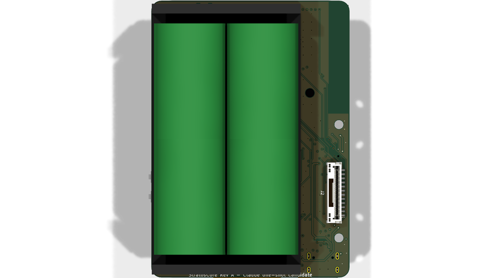 | 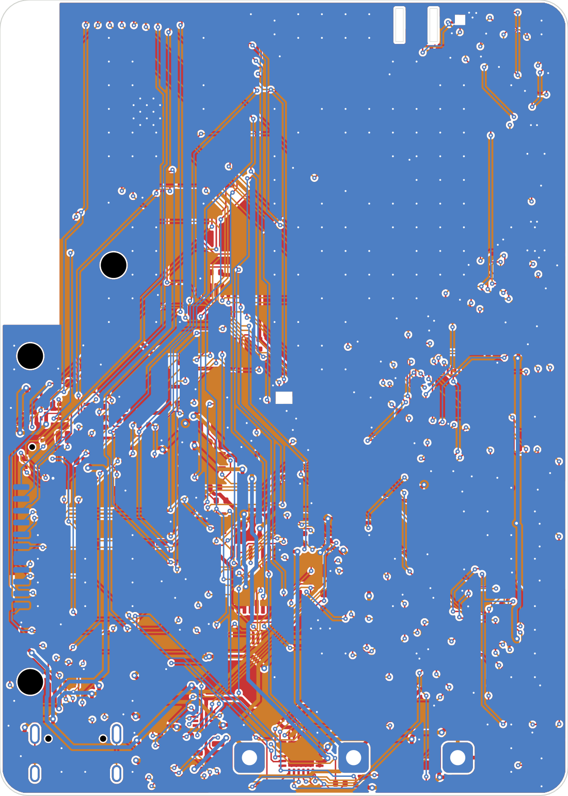 |

Schematic sheets (click to enlarge; full vector PDF: [schematic.pdf](candidates/claude-oneshot-revA/docs/schematic.pdf)):

| | | |
| --- | --- | --- |
| [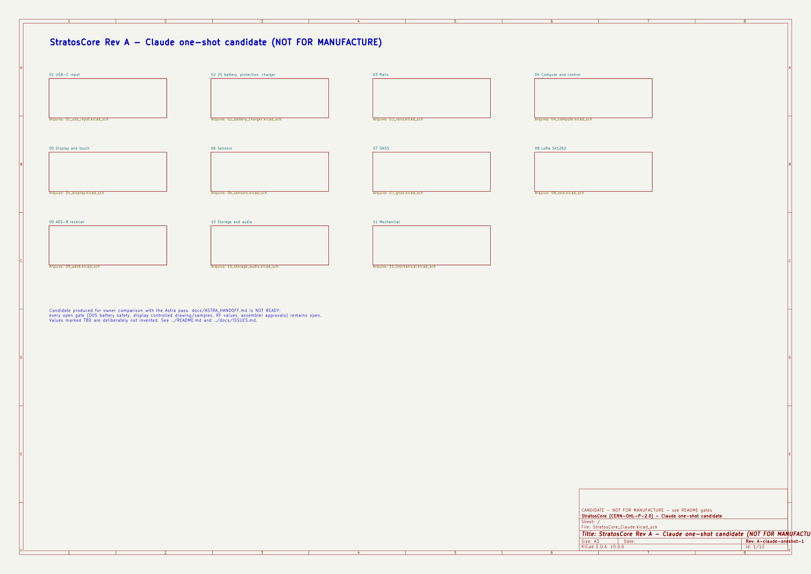](candidates/claude-oneshot-revA/images/schematic_00_root.png) Root | [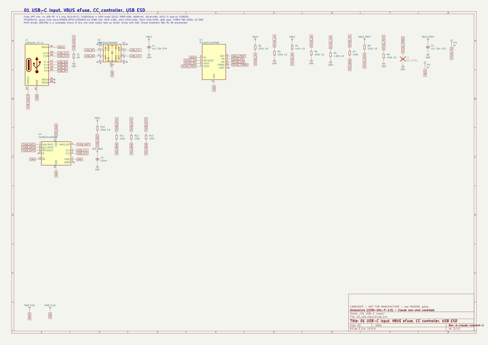](candidates/claude-oneshot-revA/images/schematic_01_usb_input.png) 01 USB-C input | [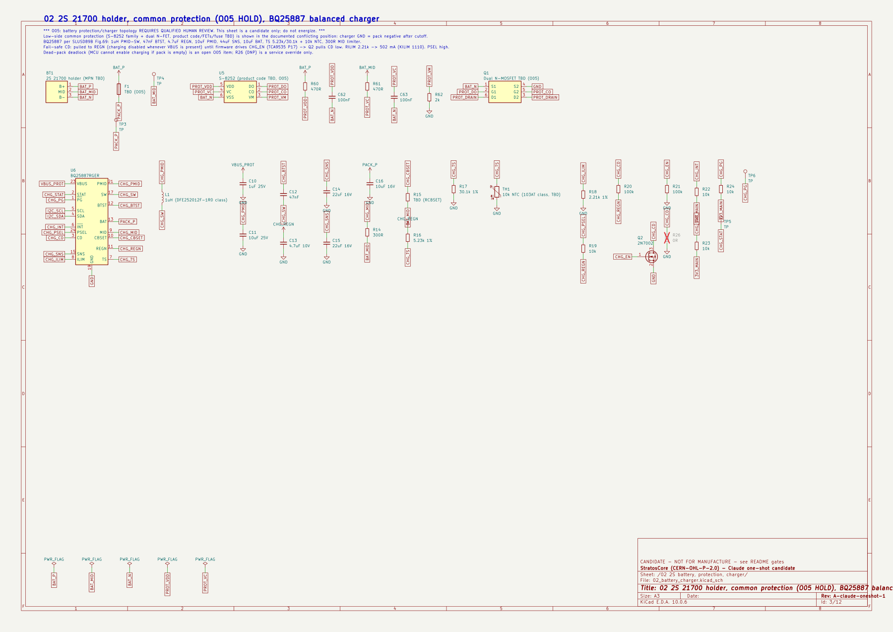](candidates/claude-oneshot-revA/images/schematic_02_battery_charger.png) 02 2S battery/charger |
| [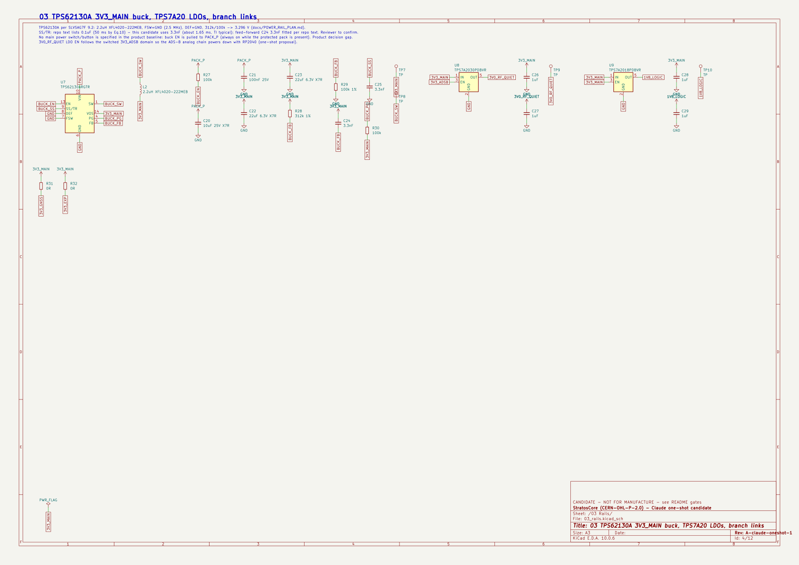](candidates/claude-oneshot-revA/images/schematic_03_rails.png) 03 Rails | [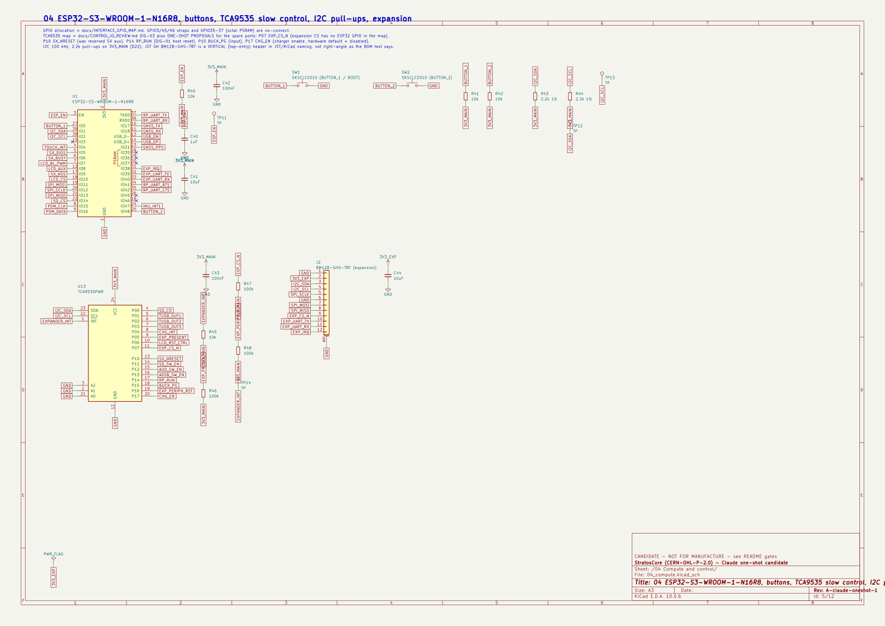](candidates/claude-oneshot-revA/images/schematic_04_compute.png) 04 ESP32 / control | [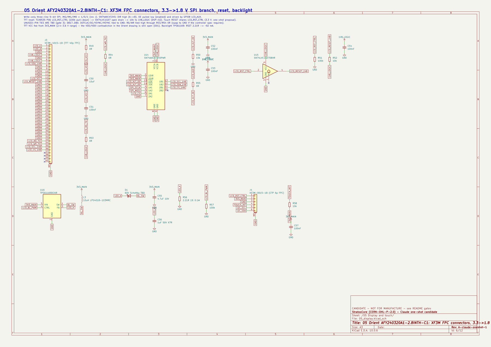](candidates/claude-oneshot-revA/images/schematic_05_display.png) 05 Display / touch |
| [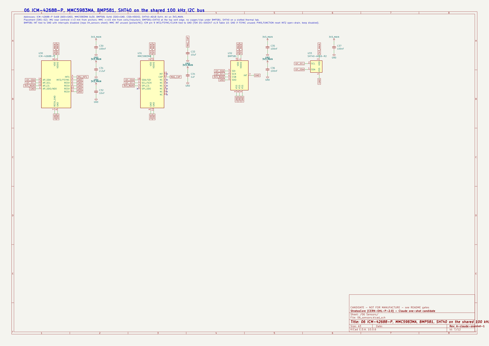](candidates/claude-oneshot-revA/images/schematic_06_sensors.png) 06 Sensors | [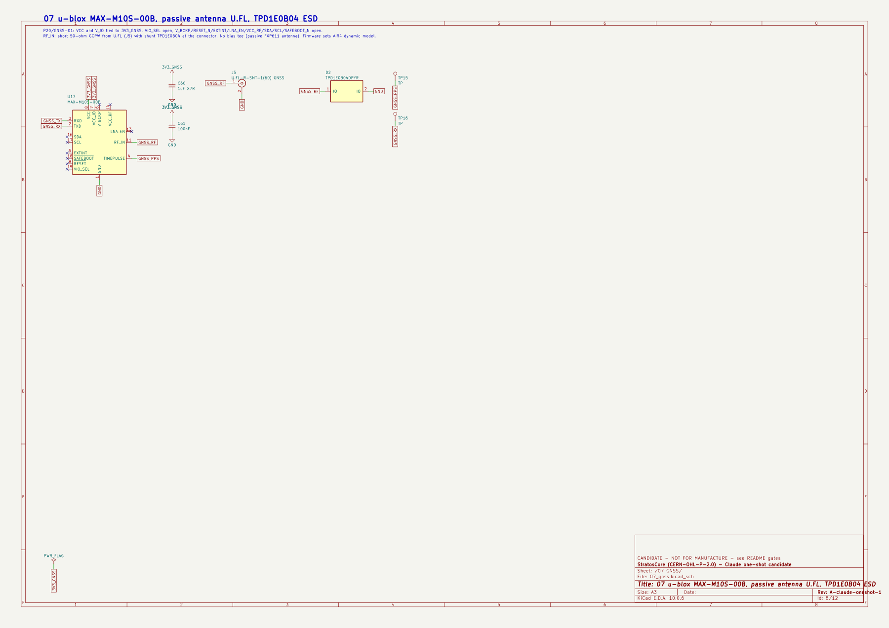](candidates/claude-oneshot-revA/images/schematic_07_gnss.png) 07 GNSS | [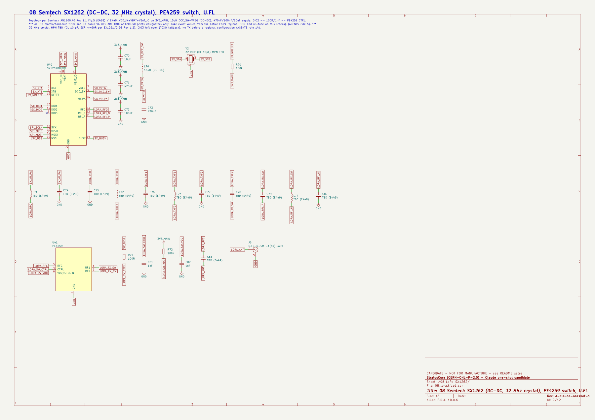](candidates/claude-oneshot-revA/images/schematic_08_lora.png) 08 LoRa |
| [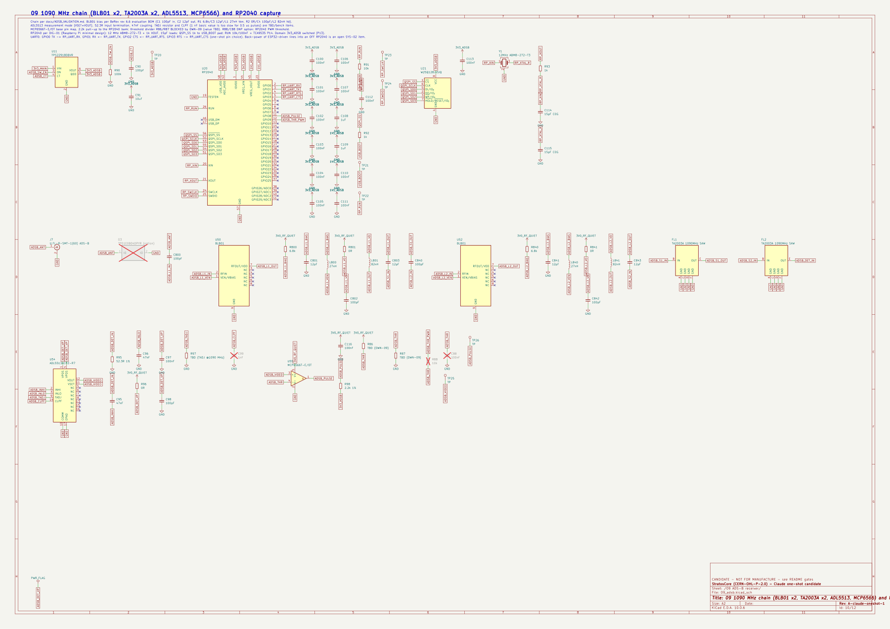](candidates/claude-oneshot-revA/images/schematic_09_adsb.png) 09 ADS-B / RP2040 | [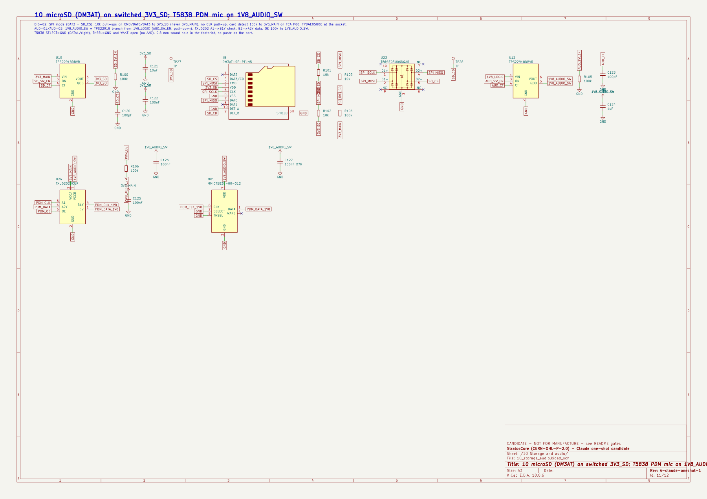](candidates/claude-oneshot-revA/images/schematic_10_storage_audio.png) 10 microSD / audio | [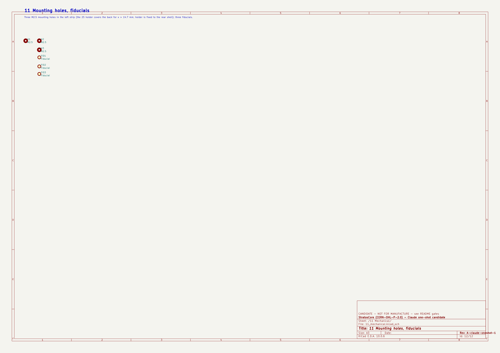](candidates/claude-oneshot-revA/images/schematic_11_mechanical.png) 11 Mechanical |

### Open it in KiCad

1. Download the repository (GitHub **Code -> Download ZIP**, or `git clone`) and install **KiCad 10** (the project uses the KiCad 10 library variables).
2. Open [`candidates/claude-oneshot-revA/kicad/StratosCore_Claude.kicad_pro`](candidates/claude-oneshot-revA/kicad/). Project symbols, footprints and 3D models are local to that folder (`libs/`), so no library setup is needed.
3. Schematic: open the root sheet and double-click a sheet box. PCB: open the board and press **Alt+3** for the 3D viewer (the display and the cells appear in 3D).
4. STEP files for FreeCAD, Fusion or any other CAD are in [`candidates/claude-oneshot-revA/outputs/StratosCore_Claude_3D_STEP.zip`](candidates/claude-oneshot-revA/outputs/StratosCore_Claude_3D_STEP.zip): the board with its display and cells, the full assembly with the enclosure, and the two enclosure parts.

| Folder | What to open |
| --- | --- |
| `candidates/claude-oneshot-revA/kicad/` | KiCad project (`.kicad_pro`, root and sheet `.kicad_sch`, `.kicad_pcb`, local libraries) |
| `candidates/claude-oneshot-revA/docs/` | `schematic.pdf`, `ISSUES.md` (findings and open gates) |
| `candidates/claude-oneshot-revA/outputs/` | STEP zip, renders, layer PDF, BOM, DRC summary, netlist |
| `candidates/claude-oneshot-revA/mech/` | Enclosure STEP parts |
| `candidates/claude-oneshot-revA/images/` | The images above |
| `candidates/claude-oneshot-revA/tools/` | Scripts that regenerate everything |

The owner set a five-unit target of at most BRL 200 per assembled PCB **including display/touch**, excluding locally bought cells and enclosure, freight and taxes. This is a hobby prototype for desk, car and protected but unpressurized aircraft-cabin use, with experimental drone, model-aircraft, balloon, ultralight, hang-glider and paramotor applications to assess separately. About 10,000 ft is the realistic altitude case; 30,000 ft is exploratory, not a guaranteed barometric limit. The BMP581 remains an indicative backup sensor, and the 8 h minimum target on two 21700 cells remains. The five boards will be programmed and tested locally through USB-C. Cost, runtime and flight performance are not yet verified.

## Rev A baseline

| Block | Baseline |
| --- | --- |
| Compute | ESP32-S3-WROOM-1-N16R8; 16 MB Flash, 8 MB PSRAM; Wi-Fi/BLE and module PCB antenna |
| User interface | 2.8-inch IPS 320 x 240 with capacitive touch; portrait/landscape; two physical buttons |
| GNSS | u-blox MAX-M10S-00B, selected for documented airborne modes to 80 km |
| Motion/environment | ICM-42688-P, MMC5983MA, BMP581 and SHT40-AD1B-R2 |
| LoRa | SX1262 directly integrated, 915 MHz class hardware, SPI and PCB U.FL; regional TX configuration required |
| ADS-B | Independent 1090 MHz receive chain with RP2040 timing processor |
| Logging/audio | Mandatory microSD and provision for an optional digital MEMS microphone |
| Power | USB-C target; two removable matched 21700 cells in 2S; one balanced charger and common protection direction |
| Expansion | 3V3, GND, I2C, SPI with separate CS, UART and GPIO/IRQ |
| Construction | Four-layer PCB; 84 x 60 mm planning outline; approximately 88 x 64 x 37 mm printed enclosure starting envelope |

Potential uses include flight/vario instruments, traffic visualization, balloon experiments, weather stations, trackers, LoRa/MeshCore experiments and portable logging. This experimental platform is not a certified aviation instrument, collision-avoidance system or cockpit voice recorder.

## Start here

1. [Project status: completed work and remaining gates](docs/PROJECT_STATUS.md)
2. [Astra-led engineering workboard](docs/PRE_ASTRA_WORKBOARD.md)
3. [Multi-agent swarm protocol and master prompt](docs/SWARM_PROTOCOL.md)
4. [Engineering documentation index](docs/README.md)
5. [Locked decisions and accepted proposals](docs/DECISIONS.md)
6. [Open engineering questions](docs/OPEN_QUESTIONS.md)

[Astra final KiCad handoff](docs/ASTRA_HANDOFF.md) is intentionally marked **NOT READY**. It is not the current work queue.

## Repository layout

```text
StratosCore/
|-- AGENTS.md          Engineering and review rules
|-- README.md          Public project status and entry points
|-- docs/              Status, decisions and subsystem specifications
|-- bom/               Preliminary planning BOM; not orderable yet
|-- hardware/          KiCad project and primary-source index
|-- candidates/        Out-of-baseline design candidates (Claude one-shot: schematic, PCB, 3D)
|-- mechanical/        Enclosure and fit-study workspace
|-- manufacturing/     Release and production-test placeholders
|-- firmware/          Hardware-interface fixtures and future firmware
|-- references/        Read-only research and reuse/license records
`-- LICENSES/          Official license texts and scope
```

## Manufacturing path

The target is four-layer PCB fabrication and automated assembly at JLCPCB or a comparable Chinese PCBA supplier. Release requires an independently reviewed schematic and layout, clean ERC/DRC, confirmed stackup, exact orderable BOM, CPL, Gerbers/drill files, assembly drawings and a programming/production-test procedure. The owner must explicitly accept the manufacturing release before ordering.

## Licensing

Original hardware, mechanical designs and hardware engineering documentation use **CERN-OHL-P-2.0**. Original firmware and its software documentation use **MIT**. See [license scope and provenance](LICENSES/README.md). Third-party work retains its own terms.
