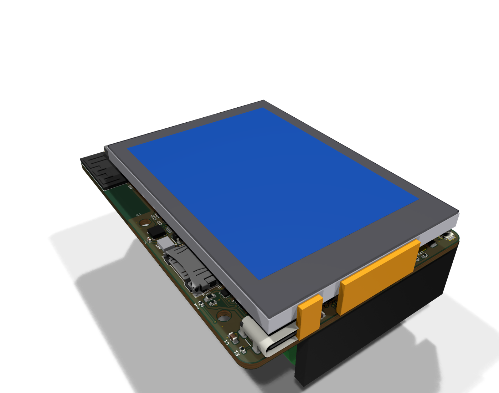
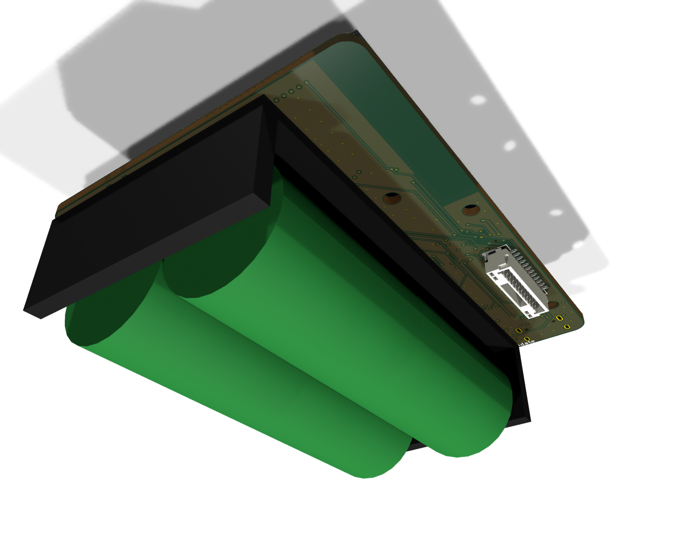
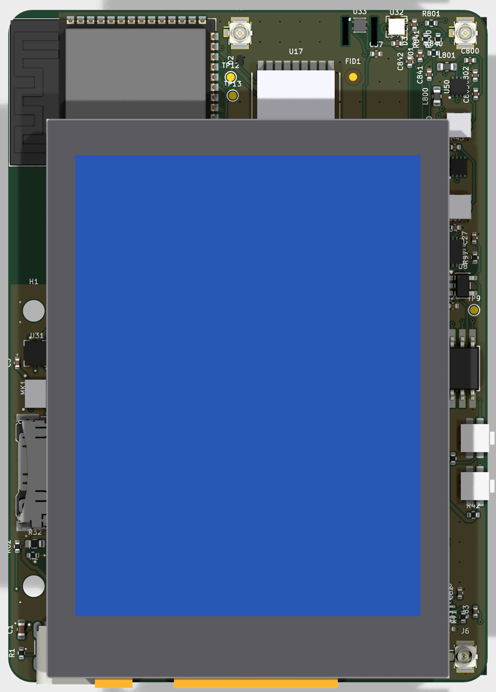
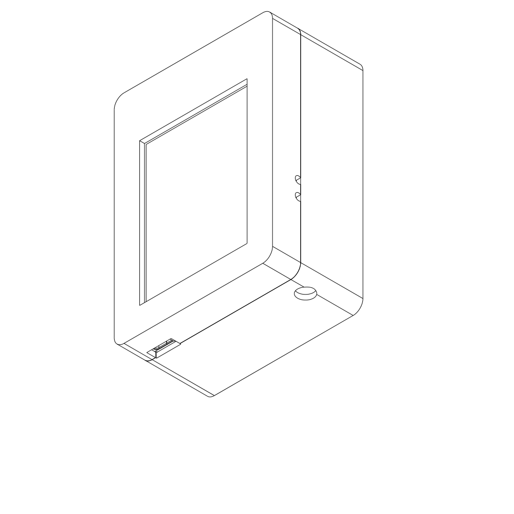

# StratosCore Rev A — Claude one-shot candidate (schematic + PCB + 3D)

> **Status: CANDIDATE FOR COMPARISON — NOT FOR MANUFACTURE, NOT A BASELINE.**
> Produced 2026-09-23 at the owner's explicit request ("1 shot" schematic, PCB and 3D with the display) to be compared with the GPT Astra pass. `docs/ASTRA_HANDOFF.md` is still **NOT READY**; nothing here closes a gate in `docs/PROJECT_STATUS.md`. Battery safety (O05) needs a qualified human reviewer — **do not energize this design with cells.** The repository baseline in `hardware/` is untouched.

| Front (display) | Back (2S 21700 cells) | PCB top | Enclosure concept |
| --- | --- | --- | --- |
|  |  |  |  |

All 12 schematic sheets are in [`images/`](images/) as PNG (`schematic_00_root.png` ... `schematic_11_mechanical.png`) and in [`docs/schematic.pdf`](docs/schematic.pdf).

## Open it in KiCad

1. Install **KiCad 10** and download/clone the repository.
2. Open `kicad/StratosCore_Claude.kicad_pro`. Symbols, footprints and 3D models used by the project live in `kicad/libs/` (`SC.kicad_sym`, `SC.pretty`, `SC.3dshapes`) and are referenced through `${KIPRJMOD}`; standard KiCad parts come from the KiCad 10 install.
3. Schematic: root sheet -> double-click a sheet box. PCB: open the board, **Alt+3** for the 3D view (display envelope 5 mm above the board, 2S cells below).
4. Other CAD tools: unzip `outputs/StratosCore_Claude_3D_STEP.zip` (board + display + cells, full assembly with enclosure, enclosure parts).

## What is in this folder

| Path | Content |
| --- | --- |
| `kicad/StratosCore_Claude.kicad_pro/.kicad_sch/.kicad_pcb` | KiCad 10.0.6 project: root + 11 hierarchical sheets, 4-layer 60 x 84 mm board |
| `kicad/libs/SC.kicad_sym`, `SC.pretty`, `SC.3dshapes` | Project symbols (datasheet pin tables), footprints (repo candidates + generated/corrected ones), STEP envelopes |
| `kicad/reports/` | ERC/DRC JSON, netlist, unassigned-pin report |
| `docs/schematic.pdf` | Schematic, 12 pages |
| `docs/ISSUES.md` | **Findings against the repo baseline (incl. 2 footprint blockers), open gates, layout limitations** |
| `outputs/` | Renders (top/bottom/iso), `StratosCore_Claude_3D_STEP.zip` (board STEP with display + 2S cells, full assembly STEP with the enclosure, enclosure parts), assembly SVG views, layer PDF, BOM, review-only positions, DRC summary |
| `mech/` | Printed enclosure concept (front bezel with display window, back shell) |
| `images/` | README images: 3D renders, enclosure views, copper layers, all schematic sheets |
| `tools/` | Reproducible generators: `design.py` (circuit), `build_sch.py`, `build_pcb.py`, `models3d.py`, `assemble.py`, `export.py` |

## Design summary

- **Compute:** ESP32-S3-WROOM-1-N16R8, GPIO map exactly as `docs/INTERFACE_GPIO_MAP.md`; antenna at the left board edge.
- **Power:** USB-C (USB4105) -> TPD4E05U06 -> TPS259474L eFuse (PWR-02 values) -> BQ25887 balanced 2S charger (TI Fig. 69 values, fail-safe CD) -> removable 2S 21700 holder -> S-8252-family protection placeholder (O05) -> TPS62130A 3V3_MAIN; TPS7A2030 quiet 3.0 V (ADS-B), TPS7A2018 1.8 V; three TPS22918 switched domains (SD, ADS-B digital, audio).
- **Display:** Orient AFY240320A1-2.8INTH-C1 on XF3M-4015/0615 FPC connectors, SN74AXC4T245 3.3->1.8 V write-only 3-line SPI, SN74LVC1G07 reset, TPS61169 backlight (2.21 ohm, ~92 mA). Modelled 5 mm above the PCB on a printed frame.
- **Sensors:** ICM-42688-P, MMC5983MA, BMP581 (vent edge, no copper under body), SHT40 on a slotted thermal tab.
- **Radios:** MAX-M10S-00B GNSS (passive antenna U.FL + TPD1E0B04), SX1262 + PE4259 (topology only, all RF values TBD), ADS-B chain BLB01 -> TA2003A -> BLB01 -> TA2003A -> ADL5513 -> MCP6566 -> RP2040 (+ W25Q128JVSIQ, ABM8-272-T3).
- **Other:** DM3AT microSD on switched 3V3_SD, T5838 PDM mic via TXU0202 on 1V8_AUDIO_SW, TCA9535 slow control, JST GH 12-pin expansion (board back), two SKSCLCE010 side buttons, test pads for rails/SWD/RUN/USB_BOOT/buses.

Every value that is not closed by a cited source is literally `TBD` in the schematic (value or `Status` field); see the BOM `Status` column.

## Verification status (measured by KiCad 10.0.6 on 2026-09-23, not claimed)

| Check | Result |
| --- | --- |
| ERC (12 sheets) | 1 error (reviewed: BMP581 `INT` output tied to GND per the repo sensor sheet, A12) + 4 warnings (translator spare input and address straps tied to a flagged rail, flattened `2N7002` library copy) |
| Schematic <-> PCB parity | **0** |
| Board | 60 x 84 mm, 4 layers (JLC04161H-3313 candidate stack), 277 footprints, 262 nets, 3 465 track segments, 654 vias |
| DRC errors | **1** — reviewed exception: the ESP32-S3-WROOM-1 library courtyard includes Espressif's 48 x 21 mm antenna-clearance region, which the GNSS U.FL (J5) overlaps; copper keepout inside the board is respected |
| DRC warnings | 579: silkscreen text size/overlap/over-copper (cosmetic reference text), 2 `lib_footprint_mismatch` (U30/U32 carry the reviewed "allow solder-mask bridge" attribute for the vendor open-mask strategy), 2 via hole-to-hole, 3 dangling RF stubs (below) |
| Unconnected | **11 items — manual finish required**: SX1262 `LORA_RFO` (pin 23) and `LORA_RFI_P` (pin 21) stubs — the matching network placement is too tight for automatic routing and its values are TBD anyway (hand layout per the E449 reference); `I2C_SDA` to the SHT40 on the vent tab; two `3V3_MAIN` links (C57 touch decoupling, SHT40 feed near the tab slot); 6 GND pour fragments needing a stitching via or short trace |

Routing: Freerouting 2.4.1 (40 passes) on an engineering-anchored placement (`tools/build_pcb.py`), then this package's A* clean-up router (`tools/gridroute.py`), automated GND via stitching (`tools/finalize.py`) and polish (`tools/polish.py`); `tools/route_all.py` chains the stages. **A low DRC count proves CAD consistency only — not RF, power, battery-safety, thermal, EMI or manufacturability.** RF paths and USB were not given controlled-impedance geometry.

## How to regenerate

```bash
"C:/Program Files/KiCad/10.0/bin/python.exe" tools/build_sch.py
```
```bash
"C:/Program Files/KiCad/10.0/bin/python.exe" tools/build_pcb.py
```
```bash
<python-with-cadquery> tools/models3d.py
```
```bash
"C:/Program Files/KiCad/10.0/bin/python.exe" tools/route_all.py --passes 40
```
```bash
"C:/Program Files/KiCad/10.0/bin/python.exe" tools/export.py
```
```bash
<python-with-cadquery> tools/assemble.py
```

STEP outputs are written to `outputs/` and committed zipped (`StratosCore_Claude_3D_STEP.zip`). Routing uses Freerouting 2.4.1 (`freerouting-2.4.1.jar`, GPL-3.0, run as an external tool only — not bundled) on an Eclipse Temurin 25 JRE; set `STRATOS_TOOLS` to the folder holding both.

## Tool provenance and licensing

- Hardware files: CERN-OHL-P-2.0 (repository policy). Generator scripts: MIT (tooling, not firmware).
- `tools/schgen.py` adapts ideas (coordinate transform, `extends` flattening, stub/label drawing) from [pantojinho/hermes-kicad-pcb](https://github.com/pantojinho/hermes-kicad-pcb) `sch_gen.py`, MIT, commit `c87e8d4`; the KiCad pitfalls list and board-from-netlist flow of `sch_to_board.py` informed `build_pcb.py`. [aklofas/kicad-happy](https://github.com/aklofas/kicad-happy) (MIT) was consulted as the review-skill reference; none of its code is included.
- KiCad library symbols/footprints/3D models are used under the KiCad libraries' license (CC-BY-SA 4.0 with the design exception).
- Datasheet facts used for new symbols/footprints are cited in each symbol `Datasheet` field / footprint `descr` and in `docs/ISSUES.md`.

## Suggested Astra comparison checklist

1. Did the other pass catch **A13 (MMC5983MA pad centres)** and **A14 (BMP581 pad centres)**, **A1/A2 (TXU0202 / TPS259474L wrong packages)** and **A3 (BM12B is vertical)**?
2. How were the GPIO gaps (A5-A8: EXP_CS, SX1262 NRESET, RP2040 RUN, touch reset) resolved?
3. Placement: antenna vs 2S holder (A16), holder vs mounting holes/THT (A15), sensor placement rules (SNS-02), RF chain adjacency.
4. Did it invent LoRa matching values, ADS-B threshold, charger/protection parts or display pin ties, or leave them TBD?
5. Routing quality of RF (GCPW), USB (90 ohm pair), buck/charger hot loops — neither pass should be trusted without hand review.
