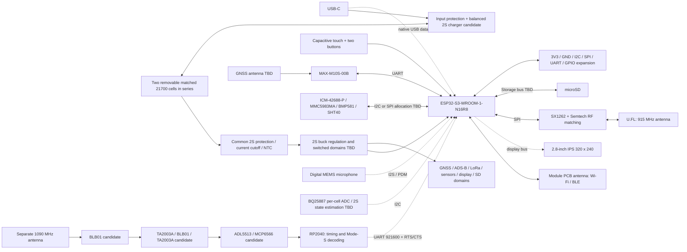

# Conceptual block diagram

Boxes are functions, not selected footprints, final rails or a wiring diagram. Dashed links are proposed interfaces. Exact routing, antenna positions and connectors are open.

The cell/charger link denotes balanced series charging with midpoint sensing, not permission to parallel removable cells. The common 2S discharge-protection and system-power path still require independent review. RF filter order and gain stages must follow blocker/noise analysis. See [power options](POWER_ARCHITECTURE_OPTIONS.md) and [ADS-B architecture](ADSB_ARCHITECTURE.md).
