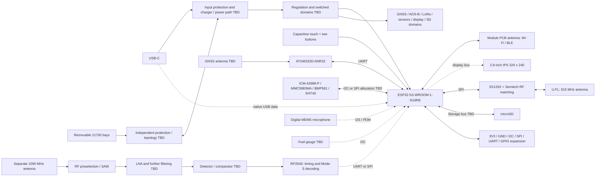

# Conceptual block diagram

Boxes are functions, not selected footprints, final rails or a wiring diagram. Dashed links are proposed interfaces. Exact routing, antenna positions and connectors are open.

The bidirectional cell/power-path link denotes the need for separately controlled charging and discharge paths, **not permission to parallel removable cells**. RF filter order and gain stages must follow blocker/noise analysis. See [power options](POWER_ARCHITECTURE_OPTIONS.md) and [ADS-B architecture](ADSB_ARCHITECTURE.md).
