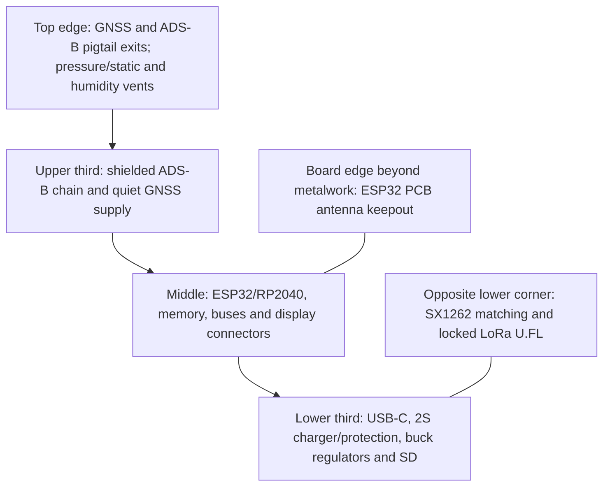

# Mechanical and RF floorplan study

Status: dimensional feasibility study, not production CAD. Review date: 2026-09-11 UTC.

## Envelope result

The exact 80 x 60 x 32 mm target is not feasible for the accepted two-cell unit with the reviewed dimensional-reference holder and all electronics.

| Item | Verified/planning envelope | Consequence |
| --- | --- | --- |
| Orient display candidate | 50.45 x 69.90 x 4.22 mm | Fits the front of an 84 x 60 mm board in portrait orientation |
| Molicel M50A cell | 21.7 mm diameter x 70.2 mm max | Two bare cells consume 43.4 mm width before separation and contacts |
| Keystone 1123 holder | approximately 82.2 x 45.1 mm; 17.27 mm holder height above PCB listed by distributor | Requires at least about 84 mm board/enclosure length |
| PCB | 1.6 mm candidate | Four-layer stackup; final tolerance open |

With the display and cells on opposite sides of one PCB, the nominal section already approaches 4.21 + 1.6 + 21.7 = 27.51 mm before adhesive, component height, air gaps and two enclosure walls. A realistic two-cell section is 36-38 mm. Rev A no longer includes the earlier one-cell enclosure variant.

**Proposed CAD starting envelope:** PCB 84 x 60 mm; two-cell enclosure about 88 x 64 x 37 mm. These are not frozen dimensions.

See the [dimensioned planning view](../mechanical/pcb_dummy/fit-check.svg) for the board zones and earlier one/two-cell section comparison. Rev A now uses the two-cell case only. The drawing is an editable study, not manufacturing CAD.

## Placement zones

- Put the ESP32 module antenna at a plastic enclosure edge with its antenna portion outside the baseboard and display metal projection. Apply Espressif's exact all-layer keepout later.
- Keep the LoRa transmit network at the corner opposite ADS-B/GNSS receive inputs. Route its U.FL pigtail away from the ESP antenna.
- Keep ADS-B connector, first LNA and first SAW filter adjacent. Reserve a grounded shield-can area and conducted-test pad/connector.
- Use an external GNSS antenna for the first prototype. It avoids an unvalidated internal patch ground plane and allows both device orientations to be tested.
- Place SHT40 and BMP581 at a vented edge on a thermally isolated tab/slot, away from chargers, backlight and exhaust air.
- Place MMC5983MA at the farthest practical corner from cells and high-current loops. Pair supply and return paths and test load-current-correlated magnetic error. Provisioning a small remote sensor board remains a fallback if calibration cannot meet the heading target.
- Keep the microSD insertion path, USB-C, buttons, battery door and all three antenna pigtails mechanically independent.

## Mechanical gates

Create a printed dummy before PCB placement: display/FPC, ESP antenna keepout, two cells and exact holder, pigtail bend radii, connectors, button actuators and vent membranes. Test insertion/removal without scraping cell wrappers, one-handed battery-door retention, polarity visibility, 1 m drop orientations, pigtail strain and access to ESP recovery plus RP2040 SWD.

The RF floorplan is acceptable for schematic partitioning. It is not sufficient for antenna approval or PCB routing; those require the final enclosure, stackup and conducted/radiated coexistence measurements.
