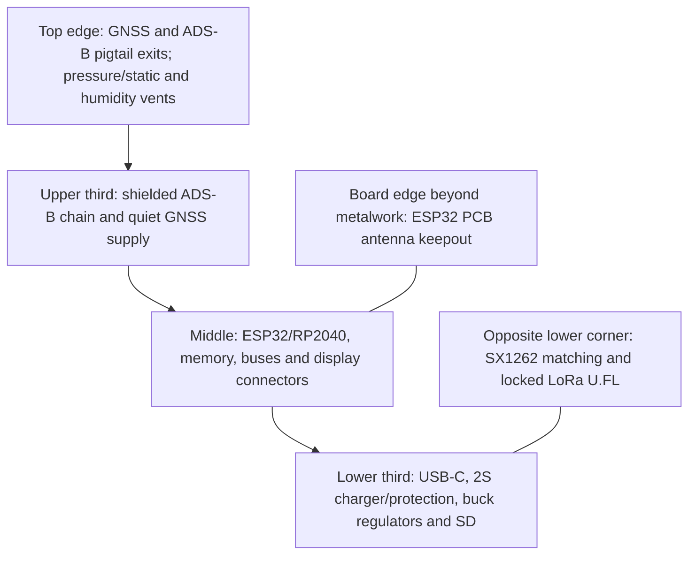

# Mechanical and RF floorplan study

Status: dimensional feasibility study, not production CAD. Review date: 2026-09-11 UTC.

## Envelope result

The exact 80 x 60 x 32 mm target is not feasible for the accepted two-cell unit with the reviewed dimensional-reference holder and all electronics.

| Item | Verified/planning envelope | Consequence |
| --- | --- | --- |
| Orient display candidate | 50.45 x 69.90 x 4.22 mm | Fits the front of an 84 x 60 mm board in portrait orientation |
| Molicel M50A cell | 21.7 mm diameter x 70.2 mm max | Two bare cells consume 43.4 mm width before separation and contacts |
| Keystone 1123 holder | approximately 82.2 x 45.1 mm; 17.27 mm holder height above PCB listed by distributor | Requires at least about 84 mm board/enclosure length |
| PCB | 1.6 mm candidate | Four-layer stackup; final tolerance open |

With the display and cells on opposite sides of one PCB, the nominal section already approaches 4.21 + 1.6 + 21.7 = 27.51 mm before adhesive, component height, air gaps and two enclosure walls. A realistic two-cell section is 36-38 mm. Rev A no longer includes the earlier one-cell enclosure variant.

**Proposed CAD starting envelope:** PCB 84 x 60 mm; two-cell enclosure about 88 x 64 x 37 mm. These are not frozen dimensions.

See the [dimensioned planning view](../mechanical/pcb_dummy/fit-check.svg) for the board zones and earlier one/two-cell section comparison. Rev A now uses the two-cell case only. The drawing is an editable study, not manufacturing CAD.

## Placement zones

- Put the ESP32 module antenna at a plastic enclosure edge with its antenna portion outside the baseboard and display metal projection. Apply Espressif's exact all-layer keepout later.
- Keep the LoRa transmit network at the corner opposite ADS-B/GNSS receive inputs. Route its U.FL pigtail away from the ESP antenna.
- Keep ADS-B connector, first LNA and first SAW filter adjacent. Reserve a grounded shield-can area and conducted-test pad/connector.
- Use an external GNSS antenna for the first prototype. It avoids an unvalidated internal patch ground plane and allows both device orientations to be tested.
- Place SHT40 and BMP581 at a vented edge on a thermally isolated tab/slot, away from chargers, backlight and exhaust air.
- Place MMC5983MA at the farthest practical corner from cells and high-current loops. Pair supply and return paths and test load-current-correlated magnetic error. Provisioning a small remote sensor board remains a fallback if calibration cannot meet the heading target.
- Keep the microSD insertion path, USB-C, buttons, battery door and all three antenna pigtails mechanically independent.

## Dimensioned placement rules (SNS-02, frozen 2026-09-22)

These constraints convert the qualitative rules above into zoned, dimensioned placement inputs for Astra. The 84 x 60 mm planning outline and the zone map above are the reference frame; all distances are minimums unless stated. Sources re-retrieved this session: TDK `AN-000393` v2.4 (PCB design/assembly guidelines for the ICM-42688-P), Bosch `BST-BMP581-DS004-13`, MEMSIC MMC5983MA Rev A, Sensirion SHT4x v7.3, plus the Molicel M50A geometry already recorded in the floorplan study.

### Sensor placement constraints

| Sensor | Zone (per the floorplan map) | Dimensioned constraint | Source class |
| --- | --- | --- | --- |
| ICM-42688-P | CORE zone, mechanically stable area near the board centroid | **>= 3 mm from any PCB anchor/screw hole/standoff/large insertion feature** (AN-000393 section 3/Figure 9); not on a flexing island; body axes documented on the fab drawing and mapped to display coordinates in firmware | DS-max (vendor application rule) |
| MMC5983MA | Corner farthest from PWR zone and cells (upper area opposite LORA) | **>= 15 mm from both 21700 cell cans and the charger/buck inductors**; **>= 10 mm from high-current loops** (2S charge path, buck input, backlight input); keepout for ferromagnetic fasteners; heading-bias test across pack state/charging/radio is the recorded acceptance test | DS class + floorplan geometry |
| BMP581 | TOP edge vent group, static-pressure side | Dedicated static vent hole **1.0-2.0 mm diameter** through the enclosure wall, **not in direct airflow**; **no routing/vias under the body** (existing footprint rule, now zoned); **>= 10 mm from the backlight boost and buck switch nodes**; not sealed-box dependent | DS class + footprint rule |
| SHT40 | TOP edge vent group, thermally isolated tab | On a **narrow thermal neck / slotted island** (slot width >= 0.8 mm class) isolating it from the main copper plane; **>= 10 mm from charger, regulators, ESP32, backlight and cells**; away from direct airflow so the humidity step response stays representative | DS class (SHT4x thermal/flow cautions) |
| T5838 microphone | TOP edge acoustic group (separate from the pressure vent) | Acoustic path per AUD-01; **>= 10 mm from the pressure vent** (their membrane/response needs differ); no paste over the port (AUD-01/DIG-04 rule) | AUD-01 cross-reference |
| ESP32-S3 module | EDGE zone (existing) | Antenna portion at a plastic enclosure edge, all-layer keepout applied from Espressif at layout; unchanged | Floorplan study |

### Zone-level rules now binding on Astra placement

1. The TOP edge carries the three sensing vents (pressure, humidity/air, acoustic) as **physically separate openings** — minimum 10 mm between the pressure vent and the acoustic opening.
2. The PWR zone (USB-C, charger, buck, SD) is the magnetic/thermal source region; the magnetometer placement rule and the SHT40 isolation rule both reference it.
3. The IMU anchor-distance rule (>= 3 mm) applies to the battery-door screws and holder lugs as anchors, not only to visible PCB standoffs.
4. Cell cans are declared soft-magnetic disturbance sources for the MMC5983MA check; the heading-bias-versus-state test remains its acceptance evidence.
5. These constraints are placement inputs, **not a release**: routing conformance, stencil/assembler rules (SNS-01/EXT-05) and the fit dummy (MECH-03) remain their recorded gates.

## Mechanical gates

Create a printed dummy before PCB placement: display/FPC, ESP antenna keepout, two cells and exact holder, pigtail bend radii, connectors, button actuators and vent membranes. Test insertion/removal without scraping cell wrappers, one-handed battery-door retention, polarity visibility, 1 m drop orientations, pigtail strain and access to ESP recovery plus RP2040 SWD.

The RF floorplan is acceptable for schematic partitioning. It is not sufficient for antenna approval or PCB routing; those require the final enclosure, stackup and conducted/radiated coexistence measurements.
