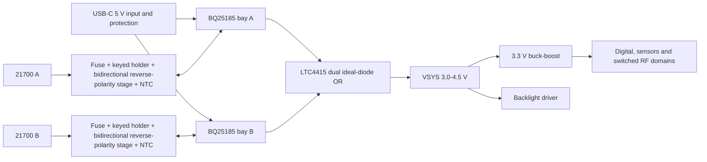

# Power architecture engineering review

Status: **candidate architecture ready for owner and qualified electrical/battery review; not frozen**. Review date: 2026-09-11 UTC.

## Recommended topology

Use two electrically independent 1S bays. The compact enclosure populates bay A only; the larger enclosure populates both.

Each BQ25185 provides a one-cell charger, battery FET, 4.5 V adapter-mode SYS regulation, dynamic power-path management, battery undervoltage lockout and approximately 3.13 A reverse overcurrent protection. The LTC4415 provides two reverse-blocked 1.7-5.5 V input paths, smooth ORing, independently adjustable current limits and no direct cell-to-cell connection. Its data sheet explicitly includes multiple-battery sharing as an application.

The architecture does **not** rely on firmware to prevent cell equalization. Each cell needs a fuse placed close to its positive contact, mechanical polarity control, an electrically reviewed bidirectional reverse-insertion stage, its own 10 kohm NTC at the cell body, and protected wiring/contact clearances. The exact MOSFET, fuse and gate network remain open because they must be proven in all USB, empty-bay and reverse-cell states.

## Candidate parts and supply snapshot

| Function | Candidate | Verified basis | Supply snapshot |
| --- | --- | --- | --- |
| Per-bay charger/power path | TI `BQ25185DLHR` | 1S, 1 A linear charger, SYS power path, TS input, 3.125 A battery OCP, 3-18 V input | DigiKey 14,696 at USD 2.28 each; LCSC 540 at USD 1.7472 each |
| Dual reverse-blocked OR | ADI `LTC4415IDHC#PBF` | Dual 4 A ideal diode, 50 mohm typical, 1 uA max reverse leakage, current limit and status | Mouser 635 at USD 10.89; 11-week factory lead time |
| Per-bay gauge candidate | ADI `MAX17048G+T10` | One-cell ModelGauge, battery insertion debounce, 3 uA hibernate, programmable alerts | DigiKey 26,327 at USD 4.61 each |
| Gauge bus isolation | TI `TCA9543APWR` | Two hot-insertion-capable I2C branches, reset and combined interrupt | Active; distributor stock to be rechecked at purchase |
| Example cell for energy/mechanics | Molicel `INR-21700-M50A` | 5.0 Ah typical, 18 Wh, 21.7 x 70.2 mm max; charge 0-45 C | Cell distributor/lot qualification remains open |
| Two-cell holder candidate | Keystone `1123` | Polarized THM holder for two 20700/21700 cells, 82.2 x 45.1 mm class envelope | DigiKey 151 plus 225 factory; about USD 12 prototype price |

Primary sources: [BQ25185](https://www.ti.com/product/BQ25185), [LTC4415](https://www.analog.com/en/products/ltc4415.html), [MAX17048](https://www.analog.com/en/products/max17048.html), [TCA9543A](https://www.ti.com/product/TCA9543A), [Molicel M50A data sheet](https://www.molicel.com/wp-content/uploads/INR21700M50A-V1-80097.pdf), and [Keystone 1123](https://www.keyelco.com/product.cfm/product_id/14554).

## USB and charging policy

Both linear chargers must not default to simultaneous 1 A charging. At 5 V input and 3.2 V cells, two 1 A channels could dissipate roughly 3.6 W in the charger paths before system load. The prototype policy is:

- hardware defaults both charge-enable inputs off until the USB current class and temperatures are valid;
- system power remains available through the power paths;
- start with one 300 mA charge channel at a time and a 500 mA total USB input ceiling;
- permit simultaneous or faster charging only after thermal testing and explicit Type-C current detection;
- inhibit charging outside the selected cell's 0-45 C charge range, independent for each bay;
- keep charge control safe if both MCUs are held in reset.

This policy is intentionally slow for two 5 Ah cells. Faster charging needs a switching dual-bay architecture or substantially more thermal area and a new review.

## Fault review matrix

| Fault/state | Required hardware behavior | Prototype acceptance test |
| --- | --- | --- |
| Cell inserted backwards | No damaging BAT-pin voltage, heating or accessible fault current | Current-limited supply emulating cell; both USB absent/present |
| Cells at different SOC | No cell-to-cell charging path | 4.2 V and 3.0 V source emulators; measure every bay current |
| Empty bay with USB | No false charging, bus back-power or hot contact above safe limit | Remove/insert each emulator in all charge-enable states |
| Cell removed under FLIGHT load | Other bay or hold-up carries load without reset, or orderly shutdown is declared | Scope VSYS/3V3 and log reset/SD integrity |
| Shorted bay | Fuse/protection isolates fault without disabling the healthy bay beyond defined transient | Electronic load and sacrificial fuse sample |
| Cold/hot cell | Charging disabled per bay while discharge policy remains explicit | NTC decade box at thresholds and fault extremes |
| USB removal during charge | Seamless transition to a valid cell; no reverse VBUS current | Scope VBUS, both SYS nodes and common VSYS |
| Both controllers reset/unpowered | Safe charge-disable default and no uncontrolled conduction | Hold CE/control rails low while sweeping sources |

## Runtime result

The display candidate's published 0.625 W module figure and a two-LNA ADS-B candidate raise the conservative FLIGHT load to 1.935 W before the 25% margin. Two 5 Ah, 3.6 V cells at 80% usable energy and 90% conversion efficiency yield 25.92 Wh delivered and about **10.72 h**, not 12 h, at 2.41875 W margin-adjusted load.

Twelve hours requires no more than 1.728 W raw average under the same assumptions, so the current FLIGHT allowance must fall by at least 0.207 W. A measured dimmed-backlight profile is the most plausible path; it must be proven with the selected display sample. Runtime is not a reason to connect cells directly in parallel.

## Review disposition

The dual independent bay concept is recommended for schematic development after acceptance. The exact reverse-polarity stage, fuse, cell/holder, charger settings, USB input controller, regulators and gauge calibration remain validation items. No prototype may be energized until another qualified electrical/battery reviewer signs the schematic fault matrix and bench limits.
