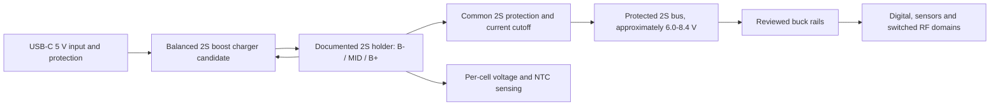

# Power architecture engineering review

Status: **2S direction accepted by owner 2026-09-13; qualified electrical/battery review pending; circuit not frozen**.

## Accepted architecture direction

Use two removable, matched 21700 cells in series. Treat them as one service pair. One balanced 2S charger manages charging, while a separate common 2S protection path guards discharge and fault states. Downstream buck regulators power the system from the 2S pack.

This meets the owner's requirement for two removable cells and one charger/control solution. It does not permit direct parallel connection. Both cells are required for operation; removing either opens the series pack. Use cells of the same qualified model, capacity class, age and verified state, and replace them as a pair.

The [low-cost marketplace holder shown by the owner](https://pt.aliexpress.com/item/1005005491570611.html) is a mechanical sample candidate only. Its listing does not establish a manufacturer, ordering code, current rating, contact material, series wiring or midpoint terminal. Verify continuity with no cells installed, obtain dimensions, inspect polarity markings and contact retention, and reject any two-terminal parallel version. The PCB needs all three 2S nodes: pack negative, midpoint and pack positive.

## First charger candidate

TI `BQ25887RGER` is the first candidate for engineering review. TI data sheet SLUSD89B, revised November 2019 and reviewed 2026-09-13, documents a 2-cell boost-mode Li-ion charger for 3.9-6.2 V USB input, up to 2 A charge current, I2C control at the default seven-bit address `0x6B`, a 16-bit ADC, per-cell measurement, NTC input and automatic balancing up to 400 mA. It is a 24-pin 4 x 4 mm VQFN.

TI's device-comparison table explicitly marks the BQ25887 as **no power path**. The load therefore remains on the protected battery bus; USB does not create an independently regulated system rail and the design does not promise batteryless operation. This is compatible with the accepted requirement that both cells be installed, but charging while the system is operating, termination under load, cold-start with a deeply discharged pack and every USB transition require review and measurement. Do not assume the charger replaces common discharge protection.

### Mandatory charger/protection contradictions found 2026-09-17

These findings prevent schematic capture of Gate 2 until the exact topology is accepted by a qualified electrical/battery reviewer:

1. `BQ25887` can start autonomous charging after power-on. Its `CD` input has an internal 900 kOhm pull-down and the reset configuration includes 4.2 V/cell regulation, 1.5 A charge current, 150 mA termination, JEITA control and a 12 h safety timer. Firmware therefore cannot truthfully promise to inspect missing, reversed or mismatched removable cells *before* any charging unless fail-safe hardware holds `CD` high until validation. The exact gate, default state and recovery path remain open.
2. A conventional low-side `S-8252` cutoff does not combine trivially with the charger's ground-referenced BAT/MID sensing and balancing. Referencing the charger before the cutoff can bypass charge protection; referencing it after the cutoff adds switch-path voltage to cell sensing and can leave BAT/MID paths attached when pack negative opens. The reviewer must choose and prove a high-side or low-side architecture, FET placement, grounds, cutoff recovery and every charger connection before an S-8252 suffix is selected.
3. Charge termination while the system is operating is not proven. The conservative 1.935 W FLIGHT allowance draws about 0.23 A from an 8.4 V pack before conversion details, already above the charger's default 150 mA termination threshold. At a 500 mA USB input limit, little or no net charging may remain after system load. The product must explicitly decide whether charging while operating is required; the circuit and firmware must then prove termination or enforce an accepted charge-only state.

For planning only, 5 V at 3 A can provide at most about 1.67 A at 8.4 V using the BQ25887 data-sheet 93.4% efficiency example and before subtracting system load. This is an upper arithmetic bound, not a selected charge rate.

### 3.3 V I2C evidence

The BQ25887 data-sheet threshold table characterizes SDA/SCL with a 1.8 V pull-up rail, which previously left the proposed 3.3 V shared bus open. TI's own `BQ25887EVM-001` user guide `SLUUC12`, February 2019, closes the voltage-level question: Table 3 identifies an onboard 3.3 V LDO as the pull-up source for SDA, SCL, INT and the other open-drain/status pins, and JP12/JP13 use 10 kOhm pull-ups for SDA/SCL. The 3.3 V bus level is therefore supported by a manufacturer evaluation implementation and remains below the device's 6 V absolute maximum.

This evidence does not select the StratosCore pull-up resistance. The final shared-bus value must be calculated from the total device, trace, connector and expansion capacitance, the slowest permitted rise time and every participant's low-level sink limit. BQ25887 keeps its documented seven-bit address `0x6B`.

### Charger topology comparison refreshed 2026-09-14

| Candidate | What it resolves | Added consequence | Current disposition |
| --- | --- | --- | --- |
| `BQ25887RGER` | 5 V USB boost charging, per-cell ADC and automatic 2S balancing in one 4 x 4 mm device | No integrated power path or batteryless operation; system load can affect charge behavior; separate protection and downstream bucks remain | **Preferred engineering candidate** for the owner's simpler two-cell direction, pending the complete review |
| `BQ25792RQMR` | 3.6-24 V buck-boost charging and an NVDC power path that can run the system from USB with depleted/removed cells | No per-cell balancing; needs separate cell monitor/balancer/protection; 5 A capability and 29-pin 4 x 4 mm implementation add unnecessary scope if batteryless operation is not required | Keep only as an alternative if batteryless USB operation becomes a requirement |

On 2026-09-14 DigiKey displayed 848 `BQ25792RQMR` in stock at EUR 5.18 quantity one with a 12-week standard lead time. The earlier BQ25887 snapshot remains below. Prices use different regional storefronts and are comparison evidence only.

### Common-protection candidates

The charger is not the pack protector. Two candidate families were reviewed without selecting an exact protection circuit:

| Candidate | Evidence | Blocking issue before selection |
| --- | --- | --- |
| TI `BQ77307RGRR` | Active 2S-7S protector; per-cell over/undervoltage, charge/discharge overcurrent, short-circuit, external-NTC limits, open-wire detection and low-side charge/discharge FET drivers; 20-pin 3.5 x 3.5 mm VQFN | Low-volume parts require host-loaded settings after reset/shutdown unless TI supplies a production OTP configuration. A reviewer must prove safe startup defaults, 2S unused-pin connections, FET/sense design and behavior when the host is unavailable |
| ABLIC `S-8252` family | Autonomous six-pin 2S overcharge, overdischarge, discharge/charge overcurrent and short-circuit protection with external FETs | Low-side cutoff conflicts above must be resolved first. `S-8252AAO-M6T1U` is only a comparison point: its full-temperature undervoltage corner can fall below the M50A 2.5 V endpoint and its overvoltage corner approaches the BQ25887 4.2 V regulation. Exact suffix/FETs remain unselected |

DigiKey displayed 2,296 `BQ77307RGRR` at USD 1.95 quantity one on 2026-09-14. ABLIC lists S-8252 as a family with multiple factory configurations; exact authorized stock remains TBD. No S-8252 implementation is preferred until the charger-ground/cutoff conflict, cell limits and reviewer requirements are resolved.

Primary evidence: [BQ25887 Rev B](https://www.ti.com/lit/ds/symlink/bq25887.pdf), especially device comparison table 5 and sections 8.3/9/11; [BQ25887EVM-001 user guide SLUUC12](https://www.ti.com/lit/ug/sluuc12/sluuc12.pdf), especially Table 3 and the schematic; [BQ25792 Rev C](https://www.ti.com/lit/ds/symlink/bq25792.pdf), especially section 9.3.8; [BQ77307 production data](https://www.ti.com/lit/ds/symlink/bq77307.pdf), especially sections 7.3-7.5 and 8; and [ABLIC S-8252 revision 4.0](https://www.ablic.com/en/doc/datasheet/battery_protection/S8252_E.pdf). Distributor snapshots: [DigiKey BQ25792RQMR](https://www.digikey.com/en/products/detail/texas-instruments/BQ25792RQMR/13577777) and [DigiKey BQ77307RGRR](https://www.digikey.com/en/products/detail/texas-instruments/BQ77307RGRR/22119518).

## USB-C input policy candidate (historical I2C proposal, superseded by D22)

`TUSB320LAIRWBR` is the Type-C CC controller candidate for a fixed upstream-facing-port/sink implementation. TI data sheet SLLSEQ8D revision D, reviewed 2026-09-14, documents attach and source-current class without USB Power Delivery. The earlier I2C/`0x47` proposal below is historical: D22 selects GPIO mode, and [power input evidence](POWER_INPUT_EVIDENCE.md) plus the [GPIO map](INTERFACE_GPIO_MAP.md) own the current wiring and conservative default-current policy. The 12-pin RWB X2QFN is 1.6 x 1.6 mm.

The 500 mA BQ25887 hardware default is **not yet an approved USB policy**. The fail-safe design must hold charger `CD` high after reset and keep charging disabled until both the removable-cell validation and the applicable USB attach/enumeration/current rules permit charging. `PSEL` high provides the charger's lower input-current class after enable; firmware may raise `IINDPM` only to a reviewed value no greater than a valid detected advertisement and must disable charging again on detach, reset, invalid state or I2C failure. This controller manages CC only; USB D+/D- remain on the ESP32 native USB path through separately selected ESD protection. No USB PD or input above 5 V is proposed.

Candidate wiring is now bounded: `PORT` to ground fixes UFP mode, `ADDR` to ground selects `0x47`, VDD uses `3V3_MAIN` with 100 nF local bypass, and `VBUS_DET` senses VBUS through 900 kOhm. The controller must remain powered whenever the 3.3 V I2C pull-ups are active. Hardware must default `CD` high and `PSEL` high; only after valid cell checks and an accepted USB current state may software enable the charger, then lower `PSEL` and program `IINDPM` no higher than an accepted 1.5 A or 3 A advertisement. Whether USB 2.0 enumeration is required before any default-current charging remains an explicit review item.

The historical candidate added one I2C address and interrupt/status path; D22 removes that bus connection. `TPS259474LRPWR` is the VBUS eFuse candidate. The current input-path calculations, default-current-only policy and unresolved ITIMER/fault limits are recorded in [power input evidence](POWER_INPUT_EVIDENCE.md); do not implement the historical values in this section as a schematic instruction.

Primary evidence: [TI TUSB320LAI product page](https://www.ti.com/product/TUSB320LAI) and [revision-D data sheet](https://www.ti.com/lit/ds/symlink/tusb320lai.pdf), especially sections 7.2.1.2, 8.2.3 and the RWB package drawing; and [TI TPS25947 product page/data sheet](https://www.ti.com/product/TPS25947). TI lists `TUSB320LAIRWBR` as active; distributor price and factory-assembly availability must be rechecked when the connector and PCBA supplier are selected.

## Cell candidate for review

The exact 21700 model is still open. `Molicel INR-21700-M50A` is the first sample candidate because its official manufacturer sheet matches the 5.0 Ah, 3.6 V planning basis already used in the runtime calculation. The reviewed sheet `INR21700M50A-V1-80097` specifies 5,000 mAh typical/4,800 mAh minimum, 4.2 V charge, 2.5 V discharge limit, 2.5 A standard charge, **20 A continuous discharge**, 25 mOhm typical DC impedance, 0 to 45 °C charging, -30 to 45 °C discharging, 21.7 x 70.2 mm maximum and 68 g typical. It is an unprotected flat-top cell; board protection remains mandatory. Holder contacts, fuse, conductors and reverse-insertion controls must be sized for a deliberately much lower system limit while safely interrupting the cell's available fault energy.

An authorized US specialty distributor displayed the M50A at USD 2.80 sale price and USD 7.99 regular price per cell on 2026-09-14. Brazilian availability, dangerous-goods shipping and authenticity controls remain open. Source: [Molicel M50A manufacturer sheet](https://www.molicel.com/wp-content/uploads/INR21700M50A-V1-80097.pdf) and [authorized-distributor listing](https://liionwholesalecorp.shop/products/molicel-npe-inr-21700-m50a-15a-5000mah-flat-top-21700-battery-authorized-distributor).

This candidate does not set the charge rate or protection thresholds. Mission temperature, runtime at cold soak, holder contact geometry and cell provenance must be accepted before the cell becomes locked.

### Cost and availability comparison checked 2026-09-13

| Architecture/candidate | Prototype parts | Snapshot | Disposition |
| --- | --- | --- | --- |
| Rejected independent 1S P08 | 2x BQ25185 + LTC4415 before gauges/protection | Earlier review: about USD 4.56 for two chargers plus USD 10.89 ORing at quantity one | Rejected by owner as excessive complexity |
| Accepted 2S direction, first charger candidate | 1x BQ25887RGER/RGET before common protection/regulators | Mouser listed 7,531 RGER at USD 5.01; DigiKey listed 235 RGET at USD 6.62; LCSC listed no stock | Candidate is cheaper and smaller than P08; recheck at purchase |

Historical BQ25887 supply sources: [TI BQ25887 product page](https://www.ti.com/product/BQ25887), [Mouser BQ25887 search](https://www.mouser.com/c/ds/?q=BQ25887RGER), [DigiKey BQ25887RGET](https://www.digikey.com/en/products/detail/texas-instruments/BQ25887RGET/10270194), and [LCSC BQ25887RGET](https://www.lcsc.com/product-detail/Battery-Management_Texas-Instruments-BQ25887RGET_C2862617.html).

## Electrical, firmware and mechanical impact

| Area | Accepted-direction impact |
| --- | --- |
| Electrical | Battery bus changes to a two-cell range; USB charging requires boost conversion; the system requires buck regulation plus common 2S over/undervoltage, overcurrent/short and thermal protection; charger defaults disabled until valid cells and an accepted USB current state |
| Firmware | Configure the charger conservatively, never exceed the CC-detected source-current class, log both cell voltages/temperature/current, detect imbalance or missing-cell states, and enter safe shutdown; firmware may not be the sole protection layer |
| PCB | Replace two 1S chargers and source-OR circuitry with one 2S charger candidate, CC controller, protection FETs/current path, midpoint sensing and reviewed switching layouts; preserve RF and magnetometer separation |
| Mechanical | Two cells and holder are mandatory; provide polarity markings, wrapper-safe insertion, retention, insulated contacts and a battery door; current stack study starts near 37 mm enclosure depth |

### Circuit starting values, not selections

- `BQ25887`: TI's application/EVM basis uses 1 uH power inductance, 1 uF at VBUS, 10 uF at PMID, 44 uF at SNS, 10 uF at BAT, 47 nF at BTST and at least 4.7 uF at REGN. Every capacitor needs DC-bias/voltage review and the layout must follow the exact TI hot-loop guidance.
- Cell balancing: the data-sheet relation gives about 40.8 Ohm and 0.41 W for a 100 mA planning point. A 400 mA example would require about 9.5 Ohm and dissipate about 1.52 W, so the maximum must not be copied without thermal and mismatch analysis.
- `TPS62130ARGTR` 3.3 V start: 2.2 uH `XFL4020-222MEB`, 10 uF/25 V input, 22 uF/6.3 V output, 0.1 uF AVIN, 0.1 uF SS/TR, 3.3 nF feed-forward and a 312 kOhm/100 kOhm divider for about 3.296 V. Final saturation current, capacitor DC bias, switching mode, transient, thermal and EMI values wait for the complete peak-load inventory.
- Open-drain pull-ups may start from TI EVM's 10 kOhm only for calculation; the shared-bus result remains open until capacitance, rise time and sink-current limits are complete.

## Required fault review and prototype tests

| Fault/state | Required hardware behavior | Prototype acceptance test |
| --- | --- | --- |
| One or both cells inserted backwards | No damaging current, charging or hot exposed contact | Current-limited cell emulators, USB absent/present, every insertion order |
| One cell missing or loses contact | Charging disabled; system shuts down without corrupting storage | Open each cell/contact during off, boot, load and charge states |
| Cells badly mismatched in voltage/capacity | Charging inhibited outside accepted entry window; no cell exceeds limits | Programmable cell emulators at boundary and fault combinations |
| Cell overvoltage/undervoltage | Independent hardware cutoff at accepted thresholds | Slowly sweep each emulator while logging charger and protection response |
| Pack short/overcurrent | Common protection and fuse strategy interrupt current within accepted energy/time | Electronic load and current-limited source before real cells |
| Cold/hot cells | Charging disabled outside the selected cells' qualified temperature window | NTC decade box and thermal chamber/controlled fixtures |
| Cell removed during logging | Defined shutdown; no SD corruption or uncontrolled reconnect cycling | Scope rails and verify logs/filesystem after contact interruption |
| USB insertion/removal | No cell overcharge, reverse VBUS current or unsafe rail transient | Scope VBUS, pack, midpoint and every regulated rail |
| Both MCUs reset or unpowered | Conservative charge/protection defaults remain enforced in hardware | Hold control interfaces reset while sweeping all sources |

## Runtime result

Two 5 Ah, 3.6 V example cells contain the same 36 Wh nameplate energy whether considered as 2S 5 Ah or two independent 1S cells. Under the existing 80% usable-energy and 90% conversion assumptions, the FLIGHT estimate is about **10.72 h**, above the owner's 8 h minimum accepted on 2026-09-22. This is an analytical allowance, not verified runtime; the exact cells, temperature, duty cycle and actual 2S-to-load conversion efficiency must be measured. See [the current power budget](POWER_BUDGET.md).

## Review disposition

The owner approved the 2S direction, not an exact circuit. Before schematic commitment or prototype energizing, a qualified electrical/battery reviewer must accept the exact cell, holder, charger application, common protection, FET/fuse/current limits, NTC placement, buck conversion, creepage/clearance, firmware-independent defaults and the complete fault-test matrix above.
