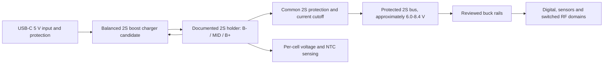

# Power architecture engineering review

Status: **2S direction accepted by owner 2026-09-13; qualified electrical/battery review pending; circuit not frozen**.

## Accepted architecture direction

Use two removable, matched 21700 cells in series. Treat them as one service pair. One balanced 2S charger manages charging, while a separate common 2S protection path guards discharge and fault states. Downstream buck regulators power the system from the 2S pack.

This meets the owner's requirement for two removable cells and one charger/control solution. It does not permit direct parallel connection. Both cells are required for operation; removing either opens the series pack. Use cells of the same qualified model, capacity class, age and verified state, and replace them as a pair.

The [low-cost marketplace holder shown by the owner](https://pt.aliexpress.com/item/1005005491570611.html) is a mechanical sample candidate only. Its listing does not establish a manufacturer, ordering code, current rating, contact material, series wiring or midpoint terminal. Verify continuity with no cells installed, obtain dimensions, inspect polarity markings and contact retention, and reject any two-terminal parallel version. The PCB needs all three 2S nodes: pack negative, midpoint and pack positive.

## First charger candidate

TI `BQ25887RGER` is the first candidate for engineering review. TI data sheet SLUSD89B, revised November 2019 and reviewed 2026-09-13, documents a 2-cell boost-mode Li-ion charger for 3.9-6.2 V USB input, up to 2 A charge current, I2C control at the default seven-bit address `0x6B`, a 16-bit ADC, per-cell measurement, NTC input and automatic balancing up to 400 mA. It is a 24-pin 4 x 4 mm VQFN.

The charger selection is not frozen. The review must resolve charging while the system is operating, USB-C advertised-current handling, charge termination under system load, cold-start with a deeply discharged pack, ship/off mode, firmware-reset defaults and whether another device or topology better provides the required system power path. Do not assume the charger replaces common discharge protection.

### Cost and availability comparison checked 2026-09-13

| Architecture/candidate | Prototype parts | Snapshot | Disposition |
| --- | --- | --- | --- |
| Rejected independent 1S P08 | 2x BQ25185 + LTC4415 before gauges/protection | Earlier review: about USD 4.56 for two chargers plus USD 10.89 ORing at quantity one | Rejected by owner as excessive complexity |
| Accepted 2S direction, first charger candidate | 1x BQ25887RGER/RGET before common protection/regulators | Mouser listed 7,531 RGER at USD 5.01; DigiKey listed 235 RGET at USD 6.62; LCSC listed no stock | Candidate is cheaper and smaller than P08; recheck at purchase |

Sources: [TI BQ25887 product page](https://www.ti.com/product/BQ25887), [TI BQ25887 Rev B data sheet](https://www.ti.com/lit/ds/symlink/bq25887.pdf), [Mouser BQ25887 search](https://www.mouser.com/c/ds/?q=BQ25887RGER), [DigiKey BQ25887RGET](https://www.digikey.com/en/products/detail/texas-instruments/BQ25887RGET/10270194), and [LCSC BQ25887RGET](https://www.lcsc.com/product-detail/Battery-Management_Texas-Instruments-BQ25887RGET_C2862617.html).

## Electrical, firmware and mechanical impact

| Area | Accepted-direction impact |
| --- | --- |
| Electrical | Battery bus changes to a two-cell range; USB charging requires boost conversion; the system requires buck regulation plus common 2S over/undervoltage, overcurrent/short and thermal protection |
| Firmware | Configure the charger conservatively, log both cell voltages/temperature/current, detect imbalance or missing-cell states, and enter safe shutdown; firmware may not be the sole protection layer |
| PCB | Replace two 1S chargers and source-OR circuitry with one 2S charger candidate, protection FETs/current path, midpoint sensing and reviewed switching layouts; preserve RF and magnetometer separation |
| Mechanical | Two cells and holder are mandatory; provide polarity markings, wrapper-safe insertion, retention, insulated contacts and a battery door; current stack study starts near 37 mm enclosure depth |

## Required fault review and prototype tests

| Fault/state | Required hardware behavior | Prototype acceptance test |
| --- | --- | --- |
| One or both cells inserted backwards | No damaging current, charging or hot exposed contact | Current-limited cell emulators, USB absent/present, every insertion order |
| One cell missing or loses contact | Charging disabled; system shuts down without corrupting storage | Open each cell/contact during off, boot, load and charge states |
| Cells badly mismatched in voltage/capacity | Charging inhibited outside accepted entry window; no cell exceeds limits | Programmable cell emulators at boundary and fault combinations |
| Cell overvoltage/undervoltage | Independent hardware cutoff at accepted thresholds | Slowly sweep each emulator while logging charger and protection response |
| Pack short/overcurrent | Common protection and fuse strategy interrupt current within accepted energy/time | Electronic load and current-limited source before real cells |
| Cold/hot cells | Charging disabled outside the selected cells' qualified temperature window | NTC decade box and thermal chamber/controlled fixtures |
| Cell removed during logging | Defined shutdown; no SD corruption or uncontrolled reconnect cycling | Scope rails and verify logs/filesystem after contact interruption |
| USB insertion/removal | No cell overcharge, reverse VBUS current or unsafe rail transient | Scope VBUS, pack, midpoint and every regulated rail |
| Both MCUs reset or unpowered | Conservative charge/protection defaults remain enforced in hardware | Hold control interfaces reset while sweeping all sources |

## Runtime result

Two 5 Ah, 3.6 V example cells contain the same 36 Wh nameplate energy whether considered as 2S 5 Ah or two independent 1S cells. Under the existing 80% usable-energy and 90% conversion assumptions, the FLIGHT estimate remains about **10.72 h**, not 12 h. The actual 2S-to-load conversion efficiency must be measured; at least 0.207 W raw average still needs to be removed under the current budget assumptions.

## Review disposition

The owner approved the 2S direction, not an exact circuit. Before schematic commitment or prototype energizing, a qualified electrical/battery reviewer must accept the exact cell, holder, charger application, common protection, FET/fuse/current limits, NTC placement, buck conversion, creepage/clearance, firmware-independent defaults and the complete fault-test matrix above.
