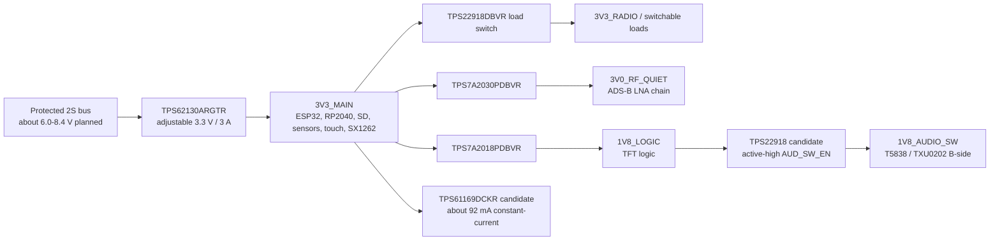

# Power rail candidate plan

Status: pre-schematic engineering proposal, reviewed 2026-09-14. This plan assigns candidate regulators to the accepted 2S architecture without releasing a circuit. Exact passive values, magnetics, compensation, thermal copper and sequencing remain application-review items.

## Proposed rail tree

## Candidate rationale

| Rail/function | Candidate | Verified capability | Remaining application work |
| --- | --- | --- | --- |
| Main 3.3 V buck | TI `TPS62130ARGTR` | Active, 3-17 V input, adjustable 0.9-6 V output, up to 3 A, 17 uA typical quiescent current, power-good and controlled soft start, 16-pin 3 x 3 mm VQFN | Compute simultaneous peak envelope; select inductor/capacitors/feed-forward values from Rev F; loop/transient/thermal/EMI simulation; prove startup from protected-pack edges and shutdown behavior |
| Quiet 3.0 V ADS-B rail | TI `TPS7A2030PDBVR` | Active fixed 3.0 V, 1.6-6 V input, 300 mA, 7 uVrms noise, high PSRR, enable pulldown, SOT-23-5 | Sum exact BLB01 and analog loads; verify 3.3-to-3.0 V dropout at maximum current/temperature; select capacitors and RF filtering; measure detector noise floor |
| 1.8 V logic rail | TI `TPS7A2018PDBVR` | Active fixed 1.8 V, same 300 mA low-noise family and inspectable SOT-23-5 package | Sum TFT translator and any microphone load; review sequencing/back-power paths; select capacitors; confirm display-reset timing |
| Switchable 3.3 V domains | TI `TPS22918DBVR` | Active, 1-5.5 V, 2 A, 52/53 mohms typical at 5/3.3 V, adjustable rise time and output discharge, SOT-23-6 | One device per rail only where isolation saves measured energy; size rise-time capacitor and discharge path; ensure every attached signal is high impedance before switch-off |
| LCD backlight | TI `TPS61169DCKR` | Active 2.7-5.5 V input boost WLED driver, 38 V output capability, PWM control, soft start and open-LED/thermal protection, SC70-5 | Feed only from `3V3_MAIN`; start near 92 mA with 2.21 ohm >=0.1 W, `LPS4018-103MRC`, >=1 uF input and 1-4.7 uF effective/50 V output; select exact 60 V-class Schottky and test samples/faults/EMI |

## Rail load inventory

Opened 2026-09-17 to make the gate 9 / O11 "complete every rail load" item auditable. Each entry carries its **evidence class**, because the earlier `3V3_MAIN` planning subtotal mixed classes and could not be used as a peak:

- **DS-max** — maximum from the exact datasheet, with revision and table.
- **DS-typ** — typical from the exact datasheet. Not a sizing figure on its own.
- **ALLOW** — engineering allowance chosen by this project. Not a component figure.
- **TBD** — not yet transcribed.

**2026-09-22 (PWR-04): the inventory is closed below with a declared concurrency model.** Datasheets re-retrieved and re-extracted this session (RP2040 build 2025-02-20 section 5.5 Table 637, Winbond W25Q128JV Rev M AC tables, TI TPS62130A/TPS7A20/TPS22918/TPS61169 application sections, SHT4x v7.3, BMP581 DS004, MMC5983MA Rev A, plus the already-recorded Espressif/Semtech/TI figures). Every row now carries DS-max, labeled DS-typ, or a declared ALLOW with rationale; **no row remains TBD** — the two quantities genuinely unknowable pre-sample (display logic demand, card-dependent peaks) are explicit ALLOWs whose replacement by measurement is already the declared post-PCBA plan.

### 3V3_MAIN closed inventory (simultaneous worst-case, FLIGHT-class: every domain enabled)

| Load | mA | Class | Source / rationale |
| --- | ---: | --- | --- |
| ESP32-S3 Wi-Fi TX | 340 | DS-typ | Espressif module datasheet table already cited; max-vs-typ correction stays flagged for bench |
| ESP32-S3 base logic allowance | 50 | ALLOW | CPU/flash/PSRAM non-radio activity at burst concurrency |
| RP2040 IOVDD (worst use-case) | 35.5 | DS-max | RP2040 Table 637 "Popcorn max average" column |
| RP2040 DVDD (via VREG from 3V3_MAIN) | 16.6 | DS-max | Table 637 DVDD max column; counts once, through VREG_VIN |
| RP2040 USB_VDD | 2.0 | DS-max | Table 637 BOOTSEL-active max (PHY kept alive for determinism) |
| W25Q128JV ICC3 (read/program class) | 20 | DS-max | Rev M AC characteristics table (8/15/12 mA typ classes -> 20 mA max at 133 MHz class) |
| Backlight conversion input reserve | 250 | ALLOW | TPS61169 input-side reserve pending measured efficiency; unchanged from the recorded proposal |
| Display logic (3.3 V side) | 30 | ALLOW | O01-controlled TFT power clarification still gates the exact figure; conservative allowance retained |
| SX1262 TX (+22 dBm class) | 118 | DS-typ | Rev 1.2 Table 3-6, as recorded for D05 |
| microSD write peak | 200 | ALLOW | Card-dependent by nature; DIG-02 routes the measured value back here |
| Sensors + touch + misc | 40 | ALLOW | Replaces the older 30 mA figure: MMC5983MA ~0.45 mA typ measure-rate class, SHT4x sub-mA class, BMP581 few-uA class, ICM-42688-P ~2 mA class, ST1633I touch and margin are far under this ceiling (datasheet classes recorded in `COMPONENT_EVIDENCE.md`/I2C budget rows) |
| TUSB320LAI (always-on) | 0.1 | DS-typ | SLLSEQ8D §6.5 IUNATTACHED_UFP, per the D22 disposition |
| TCA9535 + control misc | 1 | ALLOW | Expander static plus pull-up string dissipation |
| TPS7A2030 pass-through (3V0_RF_QUIET chain) | 85 | ALLOW | BLB01 x2 + ADL5513 + comparator chain, per `ADSB_VALIDATION.md` figures; counted at the 3V3_MAIN input of the LDO |
| TPS7A2018 pass-through (1V8_LOGIC chain) | 25 | ALLOW | 0.4 mA DS-max support static + TFT-translator dynamic + microphone allowance; conservative 25 mA ceiling retained |
| GNSS branch (3V3_GNSS filtered branch) | 100 | DS-max | u-blox R08 section 4 startup response |
| Expansion allocation | 100 | ALLOW | Half the JST GH 1 A/contact rating, pending the measured cable/current rule |
| LDO/buck quiescents | 0.5 | DS-typ | TPS62130A 17 uA + TPS7A20 class 7 uA x2 + TPS22918 leakage |
| **Simultaneous worst-case total** | **~1,413** | mixed, labeled | Sum of the rows above |
| **With 25% design margin** | **~1,767** | derived | Against the TPS62130ARGTR 3 A rating: **59% used** |

**Concurrency model (declared, not measured):** all domains ON, ESP32 Wi-Fi TX burst, SX1262 TX burst, RP2040 capture active, microSD write burst, backlight at full conversion reserve, GNSS in startup — the absolute worst steady-state the runtime profiles allow. It intentionally double-counts mutually exclusive states (e.g. GNSS startup is transient; SX1262 and Wi-Fi share time under LoRaWAN-class duty rules) — the resulting envelope is an upper bound, which is the correct basis for regulator sizing; the runtime-energy analysis stays in [the power budget](POWER_BUDGET.md), which deals in averages.

**Blocking conclusion of 2026-09-17 is resolved:** every TBD row is now transcribed or declared as a labeled allowance, and the DS-typ rows carry their labeled status. `3V3_MAIN` is adequate for the worst-case envelope with 41% headroom at the 3 A buck rating. What remains open is deliberately post-PCBA: replacing DS-typ/ALLOW rows with measurements, and the O01 display-demand figure.

### Regulator application passives (starting values, from the retrieved application sections)

| Device | Value | Source |
| --- | --- | --- |
| TPS62130ARGTR | L = 2.2 uH shielded (XFL4020 class); Cin = 10 uF; Cout = 22 uF X7R/X5R ceramic; PGOOD/SS per pins | Datasheet section 9.2.2.2 (retrieved 2026-09-22) |
| TPS7A2030PDBVR / TPS7A2018PDBVR | Cin = 1 uF, Cout = 1 uF ceramic minimum; no noise-bypass capacitor required (device uses internal reference architecture) | TPS7A20 datasheet features/recommended operating conditions |
| TPS22918DBVR x3 | CT sets slew: SR = 0.55 x CT + 30 (datasheet Eq. 3, section 9.2.2.5); **CT = 100 pF starting point (~85 us slew), verified against the units/figure at capture**; QOD discharge retained | TPS22918 Rev C application section |
| TPS61169DCKR | RSET = 204 mV / I_LED -> 2.21 ohm at 92.3 mA (confirms the standing 2.21 ohm proposal by arithmetic); L = 4.7-10 uH (10 uH LPS4018-103MRC retained); 60 V-class Schottky still open | TPS61169 Rev B (SNVSA40B, revised June 2024) Eq. 2 + inductor table |

### Thermal, transient and sequencing record

- **Buck loss at peak:** at 1.413 A out, ~90% class efficiency at 3.3 V gives about 0.5 W dissipation in the 3 x 3 mm VQFN — requires the planned ground-pour thermal copper; junction rise at board-level theta_JA ~50 C/W is about 25 C at continuous peak, acceptable for the enclosure profile and re-checked with the measured duty cycle.
- **LDO dissipation is negligible:** 0.3 V x 85 mA = 26 mW (3V0) and ~1.5 V x 25 mA = 38 mW (1V8).
- **Transients:** the envelope already contains the burst rows (Wi-Fi TX, SX1262 TX, SD write) as simultaneous DC; the 22 uF X7R output plus the buck's 3 A capability cover the superimposed sub-ms transients. Scope verification at both battery and rails stays in the measurement plan.
- **Charging interaction (D21 boundary):** charging power enters through VBUS into the 2S bus and does not flow through 3V3_MAIN; the default-current-class input (500 mA floor per PWR-02) caps charge power near 2.5 W and therefore the charge-under-load current at ~8.4 V — the exact charge-rate selection remains the O05/O06 qualified-review item, unchanged.
- **Sequencing (recorded as policy):** pack protector -> TPS62130A enable/PGOOD -> `3V3_MAIN` valid -> ESP32 boot -> TCA9535 configured -> switched domains enabled deliberately (DIG-03 pull-downs guarantee OFF until then) -> 3V0/1V8 rails follow `3V3_MAIN` monotonically (LDO outputs track input; enables strapped per datasheet). Shutdown/brownout: buck dropout behavior and protector trip ordering stay with the O05/O06 qualified review, unchanged.

The 3 A main-buck rating is headroom, not a claimed system peak. The final current envelope must include ESP32 radio bursts, RP2040, microSD writes, SX1262 TX, display/touch and every enabled peripheral at the same time. Reserve at least 250 mA of `3V3_MAIN` for the display backlight conversion pending measured efficiency and transients. Do not size the inductor or copper from the average power budget.

## Backlight application remains a separate gate

The display specification requires approximately 5.8-6.4 V at 100 mA typical for the LED string. `TPS61169DCKR` is the preferred boost constant-current candidate and must be fed from `3V3_MAIN`; its 5.5 V maximum input prohibits connection to the protected 2S bus. The initial 2.21 ohm current-set proposal gives about 92.3 mA at the typical 204 mV feedback reference and 84.2-100.5 mA across feedback/resistor tolerance. Use at least 0.1 W for RSET. The EVM's 40 V diode is too close to the 39 V OVP maximum corner for this release, so an exact 60 V-class Schottky remains open. Confirm polarity, voltage/current, luminance and thermal behavior on two labeled samples. Validate open LED, short LED, startup overshoot, PWM dimming, leakage, EMI and temperature before release.

## Startup and off-state policy

- Common battery protection and the main 3.3 V buck must reach safe states without MCU firmware.
- `3V3_MAIN` powers the controllers needed to inspect the system. Switch high-load domains only after rail-valid and configuration checks.
- Power-good, enables and reset thresholds must produce a monotonic startup and a defined shutdown before the pack protector trips.
- Any peripheral whose rail is off must not receive damaging current through signal pins. Series resistors, translators, bus switches or GPIO high-impedance states require block-by-block review.
- ADS-B power-down must include the RP2040 and analog chain while preserving a deterministic restart and host-visible reset reason.

Primary evidence: [TI TPS62130A product page and Rev F data sheet](https://www.ti.com/product/TPS62130A), [TI TPS7A20 product page and Rev H data sheet](https://www.ti.com/product/TPS7A20), [TI TPS22918 product page and Rev C data sheet](https://www.ti.com/product/TPS22918), and [TI TPS61169 Rev B data sheet](https://www.ti.com/lit/ds/symlink/tps61169.pdf). Exact orderable pages reviewed: [TPS62130ARGTR](https://www.ti.com/product/TPS62130A/part-details/TPS62130ARGTR), [TPS7A2030PDBVR](https://www.ti.com/product/TPS7A20/part-details/TPS7A2030PDBVR), [TPS7A2018PDBVR](https://www.ti.com/product/TPS7A20/part-details/TPS7A2018PDBVR), [TPS22918DBVR](https://www.ti.com/product/TPS22918/part-details/TPS22918DBVR), and [TPS61169DCKR](https://www.ti.com/product/TPS61169/part-details/TPS61169DCKR).

## Release conditions

This plan may enter the schematic only after exact load maxima and unpowered-state behavior are reconciled. The qualified battery/electrical reviewer must also approve how the protected 2S bus, charger, fuse/FET path, pack cutoff and main buck interact during USB insertion, charging under load, brownout and cell removal.
