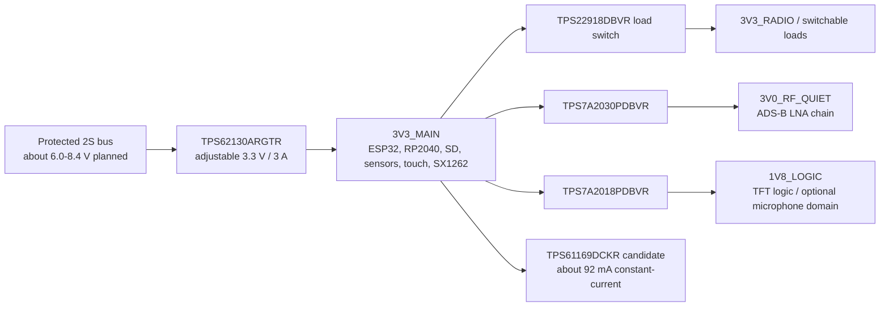

# Power rail candidate plan

Status: pre-schematic engineering proposal, reviewed 2026-09-14. This plan assigns candidate regulators to the accepted 2S architecture without releasing a circuit. Exact passive values, magnetics, compensation, thermal copper and sequencing remain application-review items.

## Proposed rail tree

## Candidate rationale

| Rail/function | Candidate | Verified capability | Remaining application work |
| --- | --- | --- | --- |
| Main 3.3 V buck | TI `TPS62130ARGTR` | Active, 3-17 V input, adjustable 0.9-6 V output, up to 3 A, 17 uA typical quiescent current, power-good and controlled soft start, 16-pin 3 x 3 mm VQFN | Compute simultaneous peak envelope; select inductor/capacitors/feed-forward values from Rev F; loop/transient/thermal/EMI simulation; prove startup from protected-pack edges and shutdown behavior |
| Quiet 3.0 V ADS-B rail | TI `TPS7A2030PDBVR` | Active fixed 3.0 V, 1.6-6 V input, 300 mA, 7 uVrms noise, high PSRR, enable pulldown, SOT-23-5 | Sum exact BLB01 and analog loads; verify 3.3-to-3.0 V dropout at maximum current/temperature; select capacitors and RF filtering; measure detector noise floor |
| 1.8 V logic rail | TI `TPS7A2018PDBVR` | Active fixed 1.8 V, same 300 mA low-noise family and inspectable SOT-23-5 package | Sum TFT translator and any microphone load; review sequencing/back-power paths; select capacitors; confirm display-reset timing |
| Switchable 3.3 V domains | TI `TPS22918DBVR` | Active, 1-5.5 V, 2 A, 52/53 mohms typical at 5/3.3 V, adjustable rise time and output discharge, SOT-23-6 | One device per rail only where isolation saves measured energy; size rise-time capacitor and discharge path; ensure every attached signal is high impedance before switch-off |
| LCD backlight | TI `TPS61169DCKR` | Active 2.7-5.5 V input boost WLED driver, 38 V output capability, PWM control, soft start and open-LED/thermal protection, SC70-5 | Feed only from `3V3_MAIN`; start near 92 mA with 2.21 ohm current-set resistor as documented in the display review; select exact inductor/diode/capacitors and test samples/faults/EMI |

The 3 A main-buck rating is headroom, not a claimed system peak. The final current envelope must include ESP32 radio bursts, RP2040, microSD writes, SX1262 TX, display/touch and every enabled peripheral at the same time. Reserve at least 250 mA of `3V3_MAIN` for the display backlight conversion pending measured efficiency and transients. Do not size the inductor or copper from the average power budget.

## Backlight application remains a separate gate

The display specification requires approximately 5.8-6.4 V at 100 mA typical for the LED string. `TPS61169DCKR` is the preferred boost constant-current candidate and must be fed from `3V3_MAIN`; its 5.5 V maximum input prohibits connection to the protected 2S bus. The initial 2.21 ohm current-set proposal gives about 92.3 mA at the typical 204 mV feedback reference and stays near/below 100 mA across the published feedback range and resistor tolerance. Confirm polarity, voltage/current, luminance and thermal behavior on two labeled samples. Validate open LED, short LED, startup overshoot, PWM dimming, leakage, EMI and temperature before release.

## Startup and off-state policy

- Common battery protection and the main 3.3 V buck must reach safe states without MCU firmware.
- `3V3_MAIN` powers the controllers needed to inspect the system. Switch high-load domains only after rail-valid and configuration checks.
- Power-good, enables and reset thresholds must produce a monotonic startup and a defined shutdown before the pack protector trips.
- Any peripheral whose rail is off must not receive damaging current through signal pins. Series resistors, translators, bus switches or GPIO high-impedance states require block-by-block review.
- ADS-B power-down must include the RP2040 and analog chain while preserving a deterministic restart and host-visible reset reason.

Primary evidence: [TI TPS62130A product page and Rev F data sheet](https://www.ti.com/product/TPS62130A), [TI TPS7A20 product page and Rev H data sheet](https://www.ti.com/product/TPS7A20), [TI TPS22918 product page and Rev C data sheet](https://www.ti.com/product/TPS22918), and [TI TPS61169 Rev B data sheet](https://www.ti.com/lit/ds/symlink/tps61169.pdf). Exact orderable pages reviewed: [TPS62130ARGTR](https://www.ti.com/product/TPS62130A/part-details/TPS62130ARGTR), [TPS7A2030PDBVR](https://www.ti.com/product/TPS7A20/part-details/TPS7A2030PDBVR), [TPS7A2018PDBVR](https://www.ti.com/product/TPS7A20/part-details/TPS7A2018PDBVR), [TPS22918DBVR](https://www.ti.com/product/TPS22918/part-details/TPS22918DBVR), and [TPS61169DCKR](https://www.ti.com/product/TPS61169/part-details/TPS61169DCKR).

## Release conditions

This plan may enter the schematic only after exact load maxima and unpowered-state behavior are reconciled. The qualified battery/electrical reviewer must also approve how the protected 2S bus, charger, fuse/FET path, pack cutoff and main buck interact during USB insertion, charging under load, brownout and cell removal.
