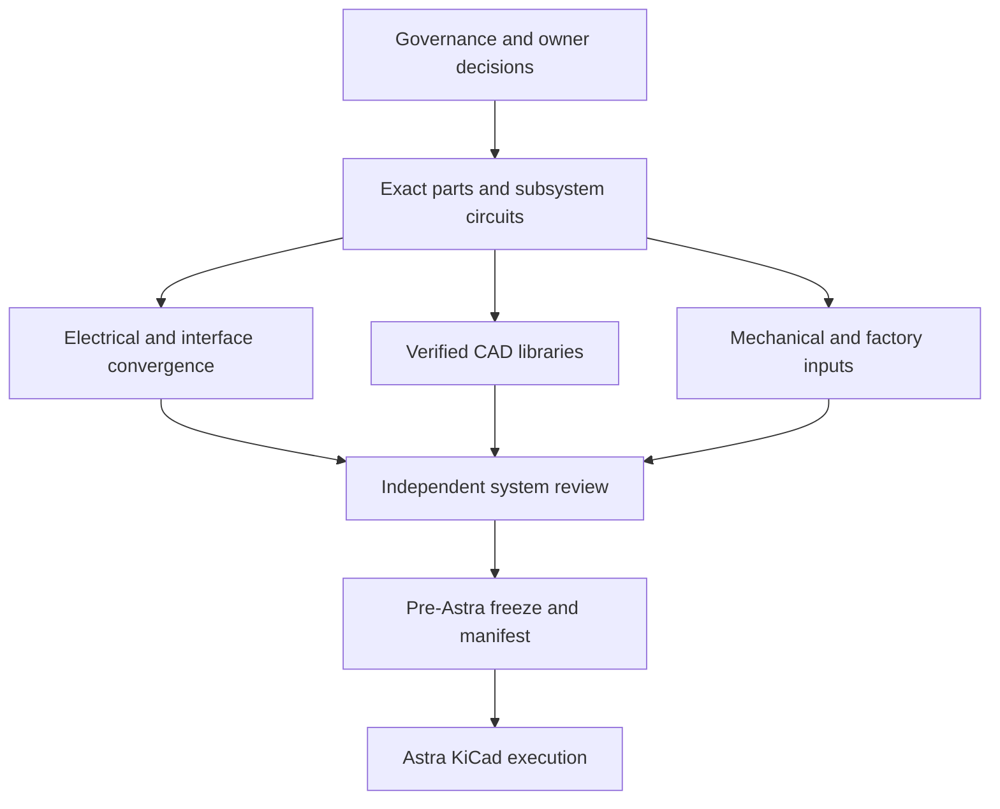

# Pre-Astra execution workboard

Status: **ACTIVE**. This is the operational queue for taking StratosCore from the current pre-KiCad engineering state to an Astra-ready input package. It does not replace [project status](PROJECT_STATUS.md), [decisions](DECISIONS.md), [open questions](OPEN_QUESTIONS.md), or the gated [Astra handoff](ASTRA_HANDOFF.md).

The workboard separates work an agent can complete from owner decisions, qualified reviews, procurement, factory confirmation, and physical tests. Writing a document is not completion by itself: each task closes only when its evidence column is satisfied.

Coordination snapshot: `origin/main` at `4498307224700837c0f1b0195be333ef9944dcf5` was reviewed on 2026-09-21 before this workboard was created. The next coordinator must replace this snapshot with the current baseline before assigning work.

Open-PR disposition at that snapshot: [PR #137](https://github.com/pantojinho/StratosCore/pull/137) is a draft vigil-round update to `AUDIT_LOG.md` that explicitly reports no engineering action. Do not merge it. Close it when GOV-02 stops or repairs the recurring no-change audit.

## Roles and state model

| Role | Authority |
| --- | --- |
| Coordinator | Assigns tasks, prevents overlap, reviews status and sequences integration; does not silently decide product or safety questions |
| Worker agent | Completes one bounded task in its allowed files and opens a reviewable PR; never merges its own work |
| Integrator | Reconciles accepted worker PRs into the central status/decision/BOM documents and publishes to `main` |
| Independent reviewer | Reviews evidence without editing the implementation under review |
| Owner | Accepts product, cost, operating-policy and regulatory decisions |
| Qualified electrical/battery reviewer | Is the only role that may approve the complete 2S safety design |
| Factory/assembler | Confirms stackup, impedance, stencil, assembly and DFM constraints |

Task states are `BACKLOG`, `READY`, `ACTIVE`, `REVIEW`, `BLOCKED_OWNER`, `BLOCKED_EXTERNAL`, `ACCEPTED`, and `SUPERSEDED`. A task may move to `ACCEPTED` only with the named evidence. Repeated status-only audits do not change task state and must not create commits.

## Dependency path

## Wave 0: control the parallel workflow

| ID | State | Owner | Task | Depends on | Allowed files | Closure evidence |
| --- | --- | --- | --- | --- | --- | --- |
| GOV-01 | ACCEPTED | Coordinator | Reconcile the current `origin/main` baseline and review substantive changes separately from audit-only commits | none | read-only | Baseline `4498307224700837c0f1b0195be333ef9944dcf5`, changed-file inventory and review findings recorded on 2026-09-21 |
| GOV-02 | READY | Automation owner | Stop any recurring job that creates audit-only `AUDIT_LOG.md` commits when no engineering delta exists | none | automation configuration only | Automation is paused or changed to trigger only on a technical delta or explicit request |
| GOV-03 | ACCEPTED | Integrator | Enforce [swarm protocol](SWARM_PROTOCOL.md), branch ownership and central-file integration rules | GOV-01 | `AGENTS.md`, `SWARM_PROTOCOL.md` | Workers use isolated branches/PRs; no concurrent central-file edits |
| GOV-04 | ACCEPTED | Integrator | Resolve the BOM circularity: pre-Astra engineering BOM versus post-capture annotated/orderable BOM | GOV-03 | `ASTRA_HANDOFF.md`, `MANUFACTURING_STRATEGY.md` | Handoff distinguishes exact pre-Astra MPN/planned-quantity input from post-Astra reference-designator BOM |

## Wave 1: owner and external inputs

These tasks can run in parallel. Agents prepare decision packets; only the named human or organization accepts them.

| ID | State | Owner | Task | Maps to | Closure evidence |
| --- | --- | --- | --- | --- | --- |
| OWN-01 | BLOCKED_OWNER | Owner | Decide whether charging while operating is required | O06, Gate 2 | Accepted operating policy and permitted USB/charge states |
| OWN-02 | BLOCKED_OWNER | Owner + electrical reviewer | Choose shared-I2C policy: 100 kHz, remove TUSB320LAI from I2C, or measured <=100 pF 400 kHz bus | P26, O11, Gate 9 | Accepted option with pull-up rail/value policy and expansion-cable rule |
| OWN-03 | BLOCKED_OWNER | Owner | Define P&D versus commercial product, target market and intended use | O21, Gate 10 | Written product/regulatory classification |
| OWN-04 | BLOCKED_OWNER | Owner | Set prototype and eventual production PCBA/BOM cost targets and initial quantity | O23, Gate 10 | Cost ceiling, currency, quantity and exclusions |
| OWN-05 | BLOCKED_OWNER | Owner | Define balloon/terrestrial mission, altitude, duration, mass, temperature, ingress, drop and vibration envelope | O16, O22, Gate 10 | Quantified mission/environment table |
| OWN-06 | BLOCKED_OWNER | Owner + logistics reviewer | Decide whether cells ship installed, separately, or are locally sourced | O24, Gate 10 | UN38.3/logistics disposition and cell-provenance plan |
| OWN-07 | BLOCKED_OWNER | Owner | Define factory firmware, serial-number and provisioning policy | O25, Gate 10 | Factory image/provisioning requirements |
| OWN-08 | BLOCKED_OWNER | Owner + mechanical/process reviewer | Decide conformal-coating and condensation/venting policy | O26, Gates 8/10 | Accepted process and enclosure policy |
| OWN-09 | BLOCKED_OWNER | Owner + RF reviewer | Define ADS-B sensitivity, range, contact and stale-time targets | O18, Gate 7 | Quantified conducted and field acceptance targets |
| EXT-01 | BLOCKED_EXTERNAL | Procurement | Obtain the controlled Orient C1 power/FPC drawing and two traceable display samples | O01, Gate 1 | Controlled drawing revision plus sample labels/photos/measurements |
| EXT-02 | BLOCKED_EXTERNAL | Procurement | Obtain an exact documented 2S 21700 holder exposing B-/MID/B+ and authentic cell samples | O05/O06, Gate 2 | Manufacturer MPN/drawing, ratings, continuity and physical samples |
| EXT-03 | BLOCKED_EXTERNAL | Qualified reviewer | Review and sign the complete 2S charger/protection/power-path design | O05, Gate 2 | Named reviewer, evidence reviewed, fault limits and written acceptance |
| EXT-04 | BLOCKED_EXTERNAL | Factory | Confirm the supported JLCPCB stack service, official 50-ohm/90-ohm solver geometries and assembly rules for layout | O10, Gate 8 | Current factory stack/solver/DFM outputs; the actual order ticket and coupon/TDR remain post-layout controls |
| EXT-05 | BLOCKED_EXTERNAL | Assembler | Approve stencil/mask/paste decisions for MEMS, GNSS, U.FL, flash, crystal and fine-pitch support parts | O19/O20, Gates 3-5 | Part-by-part written process disposition |
| EXT-06 | BLOCKED_EXTERNAL | RF lab/reviewer | Provide simulation/VNA/spectrum capability and conducted test fixtures | O03/O04/O09/O18, Gates 3/6/7 | Calibrated test plan, fixture definition and reviewer assignment |

## Wave 2: subsystem engineering

Workers in this wave must use exact manufacturer sources and stay inside their subsystem files. Work may proceed in parallel unless the dependency column says otherwise.

| ID | State | Gate | Task | Depends on | Primary files | Closure evidence |
| --- | --- | ---: | --- | --- | --- | --- |
| DSP-01 | BLOCKED_EXTERNAL | 1 | Resolve TFT VCC/VDDI/VDD, both FPC pinouts, unused pins and ST1633I address convention | EXT-01 | `DISPLAY_REQUIREMENTS.md` | Controlled-drawing transcription with no ambiguous supply or pin |
| DSP-02 | READY | 1 | Complete the three-line SPI translator/reset/backlight application and all startup/off-state calculations | DSP-01 for final acceptance | `DISPLAY_REQUIREMENTS.md`, `ELECTRICAL_COMPATIBILITY_MATRIX.md` | Exact values, tolerances, power, faults and sequence reviewed |
| DSP-03 | BLOCKED_EXTERNAL | 1 | Create and independently review exact display/touch connector footprints | EXT-01 | `hardware/footprints/`, footprint review document | KiCad export plus independent dimensional review and sample-fit result |
| DSP-04 | BLOCKED_EXTERNAL | 1 | Run two-sample display/touch/backlight bench qualification | DSP-01/02/03, EXT-01 | test report only | SPI/readability/touch/address/current/fault/EMI results |
| PWR-01 | BLOCKED_OWNER | 2 | Freeze exact cells, holder, service-pair rules, fuse and temperature-sensing requirements | OWN-01, EXT-02 | `POWER_ARCHITECTURE_REVIEW.md` | Exact MPNs and accepted electrical/mechanical limits |
| PWR-02 | READY | 2 | Close USB4105, TPD4E05U06, TUSB320LAI and TPS259474L application; remove unsupported ESD claims | OWN-02 for final bus choice | `CONNECTOR_ARCHITECTURE.md`, `POWER_INPUT_EVIDENCE.md` | Exact pins/passives/default states and USB current policy reviewed |
| PWR-03 | BLOCKED_EXTERNAL | 2 | Produce the complete BQ25887 plus common-protection topology and fault matrix | PWR-01/02, OWN-01 | `POWER_ARCHITECTURE_REVIEW.md`, `POWER_RAIL_PLAN.md` | Exact circuit proposal ready for qualified review; no unresolved ground/cutoff conflict |
| PWR-04 | READY | 2/9 | Complete rail peak inventory, regulator passives, sequencing, back-power, thermal and transient calculations | subsystem current data | `POWER_BUDGET.md`, `POWER_RAIL_PLAN.md`, matrix | Every load has sourced max/allowance; simultaneous peak and margins shown |
| PWR-05 | BLOCKED_EXTERNAL | 2 | Obtain qualified approval of PWR-03/04 and the fault-test limits | EXT-03, PWR-03/04 | reviewer record | Signed acceptance before committed schematic capture or energizing |
| GNSS-01 | READY | 3 | Finalize MAX-M10S supply/UART/PPS/no-connect/backup and passive RF application | PWR-04 | `GNSS_ARCHITECTURE.md` | Complete net/application table and PDN calculation |
| GNSS-02 | BLOCKED_EXTERNAL | 3 | Close antenna/U.FL/ESD/keepout/cable and factory process | EXT-04/05/06 | `GNSS_ARCHITECTURE.md`, `RF_CONNECTOR_SELECTION.md` | Approved RF layout constraints and mechanical fit |
| GNSS-03 | BLOCKED_EXTERNAL | 3 | Define cold-start/PPS/AIR4/coexistence tests and any pre-layout sample/fixture checks | GNSS-01/02 | test plan/report | Executable quantified plan plus available pre-layout evidence; final board results remain post-PCBA |
| DIG-01 | READY | 4 | Freeze RP2040 reset, BOOTSEL, SWD, flash and oscillator circuit | none | `DIGITAL_SUPPORT_REVIEW.md` | Pin-complete circuit specification and corner-test plan |
| DIG-02 | READY | 4 | Close microSD power, ESD, card detect, power-fail and enclosure access | MECH-02 for final fit | `DIGITAL_SUPPORT_REVIEW.md`, connector docs | Exact circuit, footprint/process and mechanical access |
| DIG-03 | READY | 4 | Close USB, expansion, buttons, GPIO expander and all reset/off-state defaults | OWN-02, PWR-02 | connector/control docs, matrix | Collision-free pins and safe hardware defaults |
| DIG-04 | READY | 4 | Create/review remaining support footprints from exact drawings | DIG-01/02/03 | `hardware/footprints/`, footprint reviews | Parse/export, automated geometry check and independent review |
| SNS-01 | BLOCKED_EXTERNAL | 5 | Obtain assembler process decisions for ICM/MMC/BMP/SHT40 | EXT-05 | sensor/footprint reviews | Written paste/mask/stencil disposition |
| SNS-02 | READY | 5/8 | Freeze orientation, magnetic, thermal, pressure-port, humidity-vent and keepout rules | OWN-05/08 for final environment | `SENSOR_ARCHITECTURE.md`, floorplan | Dimensioned placement constraints accepted |
| LORA-01 | READY | 6 | Obtain official native Semtech regional drawing/BOM; replace mirror/OCR evidence | none | `RF_ARCHITECTURE.md`, datasheet index | Official revision and exact 902-928/915 MHz values |
| LORA-02 | BLOCKED_EXTERNAL | 6 | Finalize SX1262 DC-DC, oscillator, switch, matching, balun, filter, supply and U.FL application | LORA-01, EXT-04/06 | `RF_ARCHITECTURE.md` | Exact application reviewed against final stackup; no copied trace geometry |
| LORA-03 | BLOCKED_EXTERNAL | 6 | Define conducted TX/RX/harmonic/coexistence acceptance plan | OWN-03, LORA-02 | RF validation plan | Regional settings and calibrated test limits |
| ADSB-01 | READY | 7 | Resolve MCP6566 base/R/U pin-map variant and pull-up/threshold network | OWN-09 for final threshold target | `ADSB_VALIDATION.md` | One exact MPN/package/pin map with sourced limits |
| ADSB-02 | BLOCKED_EXTERNAL | 7 | Simulate BLB01/TA2003A/ADL5513 chain, bias, gain, noise, blockers and pulse response | EXT-04/06, OWN-09 | ADS-B architecture/validation | Reviewable RF files/results and testable circuit specification |
| ADSB-03 | BLOCKED_EXTERNAL | 7 | Define conducted injection/coupon and field acceptance procedure | ADSB-02 | ADS-B validation/test docs | Quantified fixtures, stimuli, limits and coexistence tests |
| AUD-01 | READY | 4/9 | Close T5838/TXU0202 pins, OE sequence, 1.8 V load, footprint and acoustic requirements | PWR-04, OWN-05/08 | `AUDIO_ARCHITECTURE.md` | Exact application and dimensioned port/gasket rules |

## Wave 3: convergence, mechanics and manufacturing

| ID | State | Gate | Task | Depends on | Closure evidence |
| --- | --- | ---: | --- | --- | --- |
| SYS-01 | BLOCKED_OWNER | 9 | Apply accepted I2C option, compute pull-ups/capacitance/cable limit and stuck-bus recovery | OWN-02 | Non-empty electrical window and measured/declared cable rule |
| SYS-02 | BACKLOG | 9 | Complete rail/net/boot/off-state/interface matrix | Wave 2 circuits, SYS-01 | No OPEN electrical row affecting schematic connectivity |
| SYS-03 | BACKLOG | 9 | Define shared-SPI/UART/PDM/interrupt concurrency and bench stress cases | subsystem specs | Timing/resource contract with measurable limits |
| SYS-04 | BACKLOG | 9 | Perform independent full net-matrix review | SYS-02/03 | Reviewer finds no voltage/address/boot/back-power collision |
| MECH-01 | BLOCKED_EXTERNAL | 8 | Create exact component-envelope/tolerance inventory | EXT-01/02, Wave 2 exact parts | Dimensioned source table with drawing provenance |
| MECH-02 | BACKLOG | 8 | Freeze board outline, holes, display/FPC, cell removal, connectors and antenna/sensor keepouts | MECH-01, SNS-02 | Dimensioned floorplan suitable for KiCad board setup |
| MECH-03 | BLOCKED_EXTERNAL | 8 | Print and inspect a full fit dummy | MECH-02 | Signed fit review: access, retention, cables, FPC, wrapper safety and drop orientations |
| MFG-01 | BLOCKED_EXTERNAL | 8 | Freeze the supported stackup and official impedance geometries used for routing | EXT-04 | Factory-confirmed stack/solver output and tolerances; final order ticket is a post-layout control |
| MFG-02 | BACKLOG | 5/8 | Freeze DFM rules, coating/cleaning exclusions, stencil and panel assumptions | OWN-08, EXT-05 | Factory/assembler checklist accepted |
| DFT-01 | READY | 9 | Define test access for SWD, BOOTSEL, UART, USB, every rail, B-/MID/B+, charger and RF conducted ports | subsystem circuits | Named nets, pad class, access side, fixture clearance and purpose |
| REG-01 | BLOCKED_OWNER | 10 | Convert OWN-03/05/06 into a regulatory evidence plan | owner inputs | Applicable ANATEL/ANAC/DECEA/UN38.3 actions and exclusions recorded |
| BOM-01 | BACKLOG | 1-9 | Replace all seven `MPN=TBD` rows or explicitly remove/DNP them | subsystem closure | Every fitted line has exact orderable MPN |
| BOM-02 | READY | 1-9 | Collect authorized suppliers, dated availability and assembly status | exact MPNs | Sourcing evidence without fabricated IDs/stock |
| BOM-03 | BACKLOG | all | Produce the pre-Astra engineering BOM with planned quantity per block | BOM-01/02 | Exact fitted MPN/package/planned quantity/source status; no unresolved substitution |

## Wave 4: freeze and handoff

| ID | State | Owner | Task | Depends on | Closure evidence |
| --- | --- | --- | --- | --- | --- |
| INT-01 | BACKLOG | Integrator | Merge accepted subsystem PRs in dependency order and resolve only documented conflicts | Waves 1-3 | Clean, reviewable integration; no silent decision changes |
| INT-02 | BACKLOG | Integrator | Reconcile requirements, decisions, open questions, status, evidence index and BOM | INT-01 | No cross-document status/MPN/pin/power contradiction |
| REV-01 | BACKLOG | Independent reviewers | Review power, RF, digital interfaces, footprints, mechanical and sourcing packages without editing them | INT-02 | Findings resolved or explicitly retained as post-Astra/non-layout risks |
| READY-01 | BACKLOG | Coordinator + owner | Audit every Astra entry gate and create the frozen input manifest | REV-01 | Every entry-gate row has objective evidence, reviewer and date |
| READY-02 | BACKLOG | Integrator | Mark `ASTRA_HANDOFF.md` and `ASTRA_EXECUTION_PROMPT.md` READY | READY-01 | No unresolved item can change connectivity, footprint, placement, routing or factory constraints |

## Pre-Astra versus post-Astra evidence

Do not create circular gates:

- **Before Astra:** exact fitted MPNs, planned quantities, reviewed circuits, footprints, net ownership, test-point requirements, outline, stackup and placement constraints.
- **Astra produces:** annotated schematic, actual reference-designator quantities, final netlist, PCB placement/routing, ERC/DRC and review plots.
- **After Astra, before manufacturing:** final orderable BOM/CPL, RF/PDN/layout review, mechanical 3D check, Gerber/drill inspection, programming/production-test procedure and explicit owner release.

Physical validation that requires the final PCB is a post-Astra manufacturing-release gate. Pre-Astra tests use samples, EVMs, coupons or fixtures only when they can validate an input decision without depending on the final layout.

## Readiness audit

The coordinator may declare the package ready only after checking every row above and every entry gate in [ASTRA_HANDOFF.md](ASTRA_HANDOFF.md). A search that finds no obvious issue is not proof. Each accepted task needs a source, revision/date, reviewer, validation result and remaining-risk statement.
