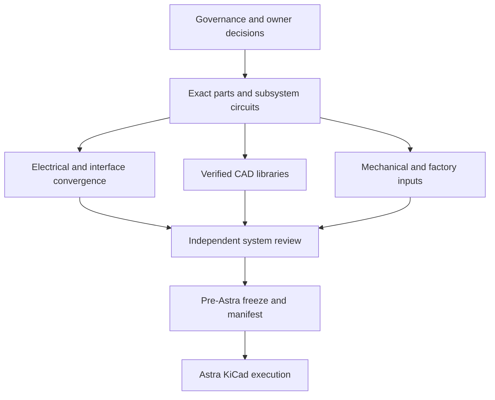

# Pre-Astra execution workboard

Status: **ACTIVE**. This is the operational queue for taking StratosCore from the current pre-KiCad engineering state to an Astra-ready input package. It does not replace [project status](PROJECT_STATUS.md), [decisions](DECISIONS.md), [open questions](OPEN_QUESTIONS.md), or the gated [Astra handoff](ASTRA_HANDOFF.md).

The workboard separates work an agent can complete from owner decisions, qualified reviews, procurement, factory confirmation, and physical tests. Writing a document is not completion by itself: each task closes only when its evidence column is satisfied.

Coordination snapshot: `origin/main` at `b77b036` reviewed on 2026-09-22 (GOV-02 retired; SYS-01 #140, ADSB-01 #142, DIG-01 #144, PWR-02 #147, DIG-03 #149 + fix #152, DIG-02 #154, PWR-04 #157, GNSS-01 #158, AUD-01 #159, DFT-01 #161, DIG-04 #164, SNS-02 #167, BOM-02 #168, DSP-02 #171 accepted; #170 folded sourcing evidence into `PROJECT_STATUS.md`/O27). Owner clarifications D24/D25 and D28 were then integrated; this snapshot identifies the reviewed prior remote baseline, not a frozen Astra manifest.

[PR #137](https://github.com/pantojinho/StratosCore/pull/137) was merged automatically while this decision update was in progress. It changed only `AUDIT_LOG.md` and explicitly reported no engineering action. **GOV-02 closed 2026-09-22:** the vigil was retired (see GOV-02 and `AUDIT_LOG.md`) and future equivalent no-change PRs must not be opened or merged.

## Roles and state model

| Role | Authority |
| --- | --- |
| Coordinator | Assigns tasks, prevents overlap, reviews status and sequences integration; does not silently decide product or safety questions |
| Worker agent | Completes one bounded task in its allowed files and opens a reviewable PR; never merges its own work |
| Integrator | Reconciles accepted worker PRs into the central status/decision/BOM documents and publishes to `main` |
| Independent reviewer | Reviews evidence without editing the implementation under review |
| Owner | Accepts product, cost, operating-policy and regulatory decisions |
| Qualified electrical/battery reviewer | Is the only role that may approve the complete 2S safety design |
| Factory/assembler | Confirms stackup, impedance, stencil, assembly and DFM constraints |

Task states are `BACKLOG`, `READY`, `ACTIVE`, `REVIEW`, `BLOCKED_OWNER`, `BLOCKED_EXTERNAL`, `ACCEPTED`, and `SUPERSEDED`. A task may move to `ACCEPTED` only with the named evidence. Repeated status-only audits do not change task state and must not create commits.

## Dependency path

## Wave 0: control the parallel workflow

| ID | State | Owner | Task | Depends on | Allowed files | Closure evidence |
| --- | --- | --- | --- | --- | --- | --- |
| GOV-01 | ACCEPTED | Coordinator | Reconcile the current `origin/main` baseline and review substantive changes separately from audit-only commits | none | read-only | Baseline `3d45c37` reconciled 2026-09-21; its latest delta was the audit-only PR #137, separated from substantive engineering changes |
| GOV-02 | ACCEPTED | Automation owner | Stop any recurring job that creates audit-only `AUDIT_LOG.md` commits when no engineering delta exists | none | automation configuration only | 2026-09-22: no external automation existed (no Actions/webhooks/cron); the loop was session-driven by the frozen procedure itself. `AUDIT_LOG.md` carries the GOV-02 retirement banner; duplicate audit-only PRs #138/#139 closed unmerged; the procedure is frozen as history |
| GOV-03 | ACCEPTED | Integrator | Enforce [swarm protocol](SWARM_PROTOCOL.md), branch ownership and central-file integration rules | GOV-01 | `AGENTS.md`, `SWARM_PROTOCOL.md` | Workers use isolated branches/PRs; no concurrent central-file edits |
| GOV-04 | ACCEPTED | Integrator | Resolve the BOM circularity: pre-Astra engineering BOM versus post-capture annotated/orderable BOM | GOV-03 | `ASTRA_HANDOFF.md`, `MANUFACTURING_STRATEGY.md` | Handoff distinguishes exact pre-Astra MPN/planned-quantity input from post-Astra reference-designator BOM |

## Wave 1: owner and external inputs

These tasks can run in parallel. Agents prepare decision packets; only the named human or organization accepts them.

| ID | State | Owner | Task | Maps to | Closure evidence |
| --- | --- | --- | --- | --- | --- |
| OWN-01 | ACCEPTED | Owner | Require operation while charging; batteryless operation remains out of scope | D21, O06, Gate 2 | Owner acceptance recorded 2026-09-21; engineering must prove charge-under-load behavior |
| OWN-02 | ACCEPTED | Owner + electrical reviewer | Use 100 kHz shared I2C and move TUSB320LAI to GPIO mode | D22/P26, O11, Gate 9 | Owner acceptance recorded 2026-09-21; SYS-01 closes pull-ups, GPIOs, cable and off-state review |
| OWN-03 | ACCEPTED | Owner | Classify Rev A as a personal, non-commercial, open-community hobby prototype | D23, O21, Gate 10 | Owner classification recorded 2026-09-21; applicable operating rules remain REG-01 work |
| OWN-04 | ACCEPTED | Owner | BRL 200 average/unit target for five units: Chinese PCBA plus display/touch; exclude local cells/enclosure, freight and taxes | D24, O23, Gate 10 | Owner confirmed 2026-09-22; actual five-unit cost feasibility remains procurement work |
| OWN-05 | ACCEPTED | Owner | Hobby desk/car/protected unpressurized cabin and possible experimental flight uses; ~10,000 ft realistic, 30,000 ft exploratory; BMP581 indicative backup; 8 h minimum on two 21700 cells. Sensor temperature and exposed-flight dynamics require engineering review | D25/D29, O16/O22, Gates 5/10 | Owner revised mission/altitude and rejected P27 on 2026-09-22; temperature, installation and balloon test envelopes remain open engineering work |
| OWN-06 | ACCEPTED | Owner + logistics reviewer | Source removable cells locally and do not ship the current prototype with cells | D26, O24, Gate 10 | Owner disposition recorded 2026-09-21; exact cell provenance remains EXT-02 engineering input |
| OWN-07 | ACCEPTED | Owner | Factory assembles PCBA only; flash/test five units locally via USB-C, retain SWD recovery, no factory credentials | D28, O25, Gate 10 | Owner confirmed 2026-09-22; local procedure and board identification remain engineering work |
| OWN-08 | ACCEPTED | Owner + mechanical/process reviewer | Use no conformal coating, ingress qualification or special environmental protection in Rev A | D27, O26, Gates 8/10 | Owner disposition recorded 2026-09-21; preserve required sensor and acoustic openings |
| OWN-09 | BLOCKED_OWNER | Owner + RF reviewer | Define ADS-B sensitivity, range, contact and stale-time targets | O18, Gate 7 | Quantified conducted and field acceptance targets |
| EXT-01 | BLOCKED_EXTERNAL | Procurement | Obtain the controlled Orient C1 power/FPC drawing and two traceable display samples | O01, Gate 1 | Controlled drawing revision plus sample labels/photos/measurements |
| EXT-02 | BLOCKED_EXTERNAL | Procurement | Obtain an exact documented 2S 21700 holder exposing B-/MID/B+ and authentic cell samples | O05/O06, Gate 2 | Manufacturer MPN/drawing, ratings, continuity and physical samples |
| EXT-03 | BLOCKED_EXTERNAL | Qualified reviewer | Review and sign the complete 2S charger/protection/power-path design | O05, Gate 2 | Named reviewer, evidence reviewed, fault limits and written acceptance |
| EXT-04 | BLOCKED_EXTERNAL | Factory | Confirm the supported JLCPCB stack service, official 50-ohm/90-ohm solver geometries and assembly rules for layout | O10, Gate 8 | Current factory stack/solver/DFM outputs; the actual order ticket and coupon/TDR remain post-layout controls |
| EXT-05 | BLOCKED_EXTERNAL | Assembler | Approve stencil/mask/paste decisions for MEMS, GNSS, U.FL, flash, crystal and fine-pitch support parts | O19/O20, Gates 3-5 | Part-by-part written process disposition |
| EXT-06 | BLOCKED_EXTERNAL | RF lab/reviewer | Provide simulation/VNA/spectrum capability and conducted test fixtures | O03/O04/O09/O18, Gates 3/6/7 | Calibrated test plan, fixture definition and reviewer assignment |

## Wave 2: subsystem engineering

Workers in this wave must use exact manufacturer sources and stay inside their subsystem files. Work may proceed in parallel unless the dependency column says otherwise.

| ID | State | Gate | Task | Depends on | Primary files | Closure evidence |
| --- | --- | ---: | --- | --- | --- | --- |
| DSP-01 | BLOCKED_EXTERNAL | 1 | Resolve TFT VCC/VDDI/VDD, both FPC pinouts, unused pins and ST1633I address convention | EXT-01 | `DISPLAY_REQUIREMENTS.md` | Controlled-drawing transcription with no ambiguous supply or pin |
| DSP-02 | ACCEPTED | 1 | Complete the three-line SPI translator/reset/backlight application and all startup/off-state calculations | DSP-01 for final acceptance | `DISPLAY_REQUIREMENTS.md`, `ELECTRICAL_COMPATIBILITY_MATRIX.md` | Delivered 2026-09-22 (PR #171): pin-complete AXC4T245 (DIR high = A->B, unused input to GND, OE HIGH = tri-state fact with 10 kohm OE pull-downs) and LVC1G07 reset path (1.8 V-domain output pull-up, expander-side 3.3 V control with pull-down); sequence resistor-backed; final acceptance remains with DSP-01/EXT-01 controlled drawing + two samples |
| DSP-03 | BLOCKED_EXTERNAL | 1 | Create and independently review exact display/touch connector footprints | EXT-01 | `hardware/footprints/`, footprint review document | KiCad export plus independent dimensional review and sample-fit result |
| DSP-04 | BLOCKED_EXTERNAL | 1 | Run two-sample display/touch/backlight bench qualification | DSP-01/02/03, EXT-01 | test report only | SPI/readability/touch/address/current/fault/EMI results |
| PWR-01 | BLOCKED_EXTERNAL | 2 | Freeze exact cells, holder, service-pair rules, fuse and temperature-sensing requirements | OWN-01, EXT-02 | `POWER_ARCHITECTURE_REVIEW.md` | Exact MPNs and accepted electrical/mechanical limits |
| PWR-02 | ACCEPTED | 2 | Close USB4105, TPD4E05U06, TUSB320LAI and TPS259474L application; remove unsupported ESD claims | OWN-02 for final bus choice | `CONNECTOR_ARCHITECTURE.md`, `POWER_INPUT_EVIDENCE.md` | Delivered 2026-09-22 (PR #147): eFuse network exact (RILM 1.69 k -> 1.97 A, UVLO 3.98 V, OVLO 6.50 V, dVdt open, ITIMER at O06), default-current-only sink policy from GPIO-mode CC, TUSB320LAI wired per D22, device-level-only ESD claim corrected; O05 untouched |
| PWR-03 | BLOCKED_EXTERNAL | 2 | Produce the complete BQ25887 plus common-protection topology and fault matrix | PWR-01/02, OWN-01 | `POWER_ARCHITECTURE_REVIEW.md`, `POWER_RAIL_PLAN.md` | Exact circuit proposal ready for qualified review; no unresolved ground/cutoff conflict |
| PWR-04 | ACCEPTED | 2/9 | Complete rail peak inventory, regulator passives, sequencing, back-power, thermal and transient calculations | subsystem current data | `POWER_BUDGET.md`, `POWER_RAIL_PLAN.md`, matrix | Delivered 2026-09-22 (PR #157): simultaneous worst-case ~1413 mA / ~1767 mA with margin = 59% of the 3 A buck rating; every row DS-max/DS-typ or labeled ALLOW; LDO pass-throughs counted; regulator passives pinned to datasheet apps; sequencing policy recorded; measurements remain post-PCBA |
| PWR-05 | BLOCKED_EXTERNAL | 2 | Obtain qualified approval of PWR-03/04 and the fault-test limits | EXT-03, PWR-03/04 | reviewer record | Signed acceptance before committed schematic capture or energizing |
| GNSS-01 | ACCEPTED | 3 | Finalize MAX-M10S supply/UART/PPS/no-connect/backup and passive RF application | PWR-04 | `GNSS_ARCHITECTURE.md` | Delivered 2026-09-22 (PR #158): complete 18-pin net/application table + PDN calculation (series budget vs the 0.2 ohm u-blox limit, bead DCR <= 0.15 ohm rule, module-local capacitance, soft-start ramp argument); independent RF/PDN review and owner/RF acceptance of the PROPOSED choices remain deliberately open |
| GNSS-02 | BLOCKED_EXTERNAL | 3 | Close antenna/U.FL/ESD/keepout/cable and factory process | EXT-04/05/06 | `GNSS_ARCHITECTURE.md`, `RF_CONNECTOR_SELECTION.md` | Approved RF layout constraints and mechanical fit |
| GNSS-03 | BLOCKED_EXTERNAL | 3 | Define cold-start/PPS/AIR4/coexistence tests and any pre-layout sample/fixture checks | GNSS-01/02 | test plan/report | Executable quantified plan plus available pre-layout evidence; final board results remain post-PCBA |
| DIG-01 | ACCEPTED | 4 | Freeze RP2040 reset, BOOTSEL, SWD, flash and oscillator circuit | none | `DIGITAL_SUPPORT_REVIEW.md` | Delivered 2026-09-22 (PR #144): pin-complete power/reset/BOOTSEL/SWD/oscillator specification from the RP2040 datasheet and the Raspberry Pi hardware design guide (RUN 10 k/100 n RC + host control, reference BOOTSEL R1/R2 arrangement, tag-connect-class SWD, 24 MHz SWD max); corner test plan declared; switched-domain flash-quiesce TBD retained for SYS-02 |
| DIG-02 | ACCEPTED | 4 | Close microSD power, ESD, card detect, power-fail and enclosure access | MECH-02 for final fit | `DIGITAL_SUPPORT_REVIEW.md`, connector docs | Delivered 2026-09-22 (PR #154): switched `3V3_SD` behind the corrected DIG-03 enable, SPI-mode mapping (SD_CS -> DAT3 CS), pull-rail ownership with back-power rationale, CLK pull-up exclusion, DM3 detect wiring, socket-edge ESD array (device-level claim only), power-fail fresh-init rule, DFT hooks; enclosure fit stays MECH-02/03; insertion surge -> PWR-04, ESD MPN purchase check -> TBD |
| DIG-03 | ACCEPTED | 4 | Close USB, expansion, buttons, GPIO expander and all reset/off-state defaults | OWN-02, PWR-02 | connector/control docs, matrix | Delivered 2026-09-22 (PR #149 + polarity fix #152): complete 16-port TCA9535 map with per-net external safe-state resistors; switched-domain enables are pull-down + active-high EN per TPS22918 (dead expander = domains OFF; `*_EN` net rename recorded for Astra); expander VDD on always-on `3V3_MAIN`; ESP32/RP2040 recovery routes counted without the expander; matrix defaults row closed |
| DIG-04 | ACCEPTED | 4 | Create/review remaining support footprints from exact drawings | DIG-01/02/03 | `hardware/footprints/`, footprint reviews | Delivered 2026-09-22 (PR #164): 8 support-part footprints added from the official KiCad 10 library with per-file provenance (TPS7A20, TPS22918, TPS61169, TXU0202, TCA9535, TUSB320LAI, TPS259474L, TPS62130A); all 17 project footprints parse/export in KiCad 10.0.6; independent exact-MPN second pass for the new eight remains open; USB4105, BM12B, SKSCLCE010, ST1633I connector and T5838 acoustic land deliberately deferred with controlling documents recorded |
| SNS-01 | BLOCKED_EXTERNAL | 5 | Obtain assembler process decisions for ICM/MMC/BMP/SHT40 | EXT-05 | sensor/footprint reviews | Written paste/mask/stencil disposition |
| SNS-02 | ACCEPTED | 5/8 | Freeze orientation, magnetic, thermal, pressure-port, humidity-vent and keepout rules | OWN-05/08 for final environment | `SENSOR_ARCHITECTURE.md`, floorplan | Delivered 2026-09-22 (PR #167): dimensioned placement constraints frozen into `MECHANICAL_RF_FLOORPLAN.md` (IMU >=3 mm anchor rule per AN-000393 v2.4; magnetometer >=15 mm cell/inductor + >=10 mm loop distances; BMP static vent 1.0-2.0 mm + under-body no-route; SHT40 slotted island; acoustic >=10 mm from pressure vent; PWR zone declared source region); assembler rules (SNS-01) and fit dummy (MECH-03) remain separate gates |
| SNS-03 | PARTIAL | 5 | Retain BMP581; define indicative ~10,000 ft pressure/vario bench test, calibration/invalid-data policy, vent and board-temperature limits. [P27 comparison](BAROMETER_30K_PROPOSAL.md) is rejected history | D25/D29; actual installation/temperature data for performance claims | [BMP581 validation plan](BMP581_VALIDATION_PLAN.md) drafted 2026-09-22 with source, pre-/post-PCBA split and proposed validity contract; numerical project limits, firmware implementation, reviewer acceptance, assembler/vent/temperature evidence remain. No LPS22HBTR design or 30,000 ft guarantee |
| LORA-01 | READY | 6 | Obtain official native Semtech regional drawing/BOM; replace mirror/OCR evidence | none | `RF_ARCHITECTURE.md`, datasheet index | Blocked evidence note 2026-09-22: Semtech's public Salesforce CDN returns "content deleted" for all four SX1262DVK1 design-file packages (E428V03A/E449V01A); official-channel retrieval requires an owner/Semtech support request. Mirror AN1200.40 Rev 1.1 (MD5 985aa7de4bedd036de94bdb7f642e981) remains the verified evidence base |
| LORA-02 | BLOCKED_EXTERNAL | 6 | Finalize SX1262 DC-DC, oscillator, switch, matching, balun, filter, supply and U.FL application | LORA-01, EXT-04/06 | `RF_ARCHITECTURE.md` | Exact application reviewed against final stackup; no copied trace geometry |
| LORA-03 | BLOCKED_EXTERNAL | 6 | Define conducted TX/RX/harmonic/coexistence acceptance plan | OWN-03, LORA-02 | RF validation plan | Regional settings and calibrated test limits |
| ADSB-01 | ACCEPTED | 7 | Resolve MCP6566 base/R/U pin-map variant and pull-up/threshold network | OWN-09 for final threshold target | `ADSB_VALIDATION.md` | Delivered 2026-09-22 (PR #142): base `MCP6566T-E/OT` pin map frozen (Table 3-1, DS20002143G Rev G; R/U documented as non-drop-in alternates), pull-up 2.2 kohm with RC/sink/dissipation math, threshold divider formula recorded with the value explicitly blocked on OWN-09 |
| ADSB-02 | BLOCKED_EXTERNAL | 7 | Simulate BLB01/TA2003A/ADL5513 chain, bias, gain, noise, blockers and pulse response | EXT-04/06, OWN-09 | ADS-B architecture/validation | Reviewable RF files/results and testable circuit specification |
| ADSB-03 | BLOCKED_EXTERNAL | 7 | Define conducted injection/coupon and field acceptance procedure | ADSB-02 | ADS-B validation/test docs | Quantified fixtures, stimuli, limits and coexistence tests |
| AUD-01 | ACCEPTED WITH AUD-02 FOLLOW-UP | 4/9 | Close T5838/TXU0202 pins, OE sequence, 1.8 V load, footprint and acoustic requirements | PWR-04, OWN-05/08 | `AUDIO_ARCHITECTURE.md` | Delivered 2026-09-22 (PR #159): TXU0202 directions, mic supply/bypass/HQ clock and DS section 9 acoustic rules. Its original OE-to-`1V8_LOGIC` rail assignment was found inconsistent with the switched-audio control; AUD-02 owns the proposed `1V8_AUDIO_SW` reconciliation and must close before Astra. Port/gasket remains MECH-02/03 |
| AUD-02 | READY | 4/9 | Complete the proposed separate `1V8_AUDIO_SW` TPS22918 application and TXU0202/mic off-state proof after [audio-domain integration review](AUDIO_DOMAIN_REVIEW.md) | AUD-01, DIG-03, SYS-02 | `AUDIO_ARCHITECTURE.md`, `CONTROL_IO_REVIEW.md`, `POWER_RAIL_PLAN.md`, electrical matrix | Exact VIN/VOUT/CT/QOD/capacitor/EN nets and ramp/drop math; microphone/translator/ESP32 pin-state matrix; independent review before schematic commitment. Keep TFT on upstream `1V8_LOGIC` |

## Wave 3: convergence, mechanics and manufacturing

| ID | State | Gate | Task | Depends on | Closure evidence |
| --- | --- | ---: | --- | --- | --- |
| SYS-01 | ACCEPTED | 9 | Apply D22/P26: remove TUSB320LAI from I2C, allocate its GPIO mode, and compute the 100 kHz pull-ups/capacitance/cable limit and stuck-bus recovery | OWN-02 | Required: non-empty electrical window and declared cable/off-state rule. Delivered 2026-09-22 via PR #140: 100 kHz window non-empty to the 400 pF ceiling (Rp_min 967 ohm, preferred 2.2 k +/-1%), expansion-cable reserve <=150 pF declared, stuck-bus recovery assigned, TUSB320LAI GPIO-mode wiring pinned to SLLSEQ8D Rev D; per-device off-state review explicitly retained as remaining gate-9/board work |
| SYS-02 | BACKLOG | 9 | Complete rail/net/boot/off-state/interface matrix | Wave 2 circuits, SYS-01 | No OPEN electrical row affecting schematic connectivity |
| SYS-03 | PARTIAL | 9 | Define shared-SPI/UART/PDM/interrupt concurrency and bench stress cases | subsystem specs | [Concurrency contract](CONCURRENCY_CONTRACT.md) drafted 2026-09-22: resource allocation, LCD/RP UART/GNSS arithmetic and post-PCBA stress procedure. Exact SX1262 deadline, SPI chunk, SD busy envelope, DMA buffers and measured scheduling limits remain TBD; independent review required before acceptance |
| SYS-04 | BACKLOG | 9 | Perform independent full net-matrix review | SYS-02/03 | Reviewer finds no voltage/address/boot/back-power collision |
| MECH-01 | BLOCKED_EXTERNAL | 8 | Create exact component-envelope/tolerance inventory | EXT-01/02, Wave 2 exact parts | Dimensioned source table with drawing provenance |
| MECH-02 | BACKLOG | 8 | Freeze board outline, holes, display/FPC, cell removal, connectors and antenna/sensor keepouts | MECH-01, SNS-02 | Dimensioned floorplan suitable for KiCad board setup |
| MECH-03 | BLOCKED_EXTERNAL | 8 | Print and inspect a full fit dummy | MECH-02 | Signed fit review: access, retention, cables, FPC, wrapper safety and drop orientations |
| MFG-01 | BLOCKED_EXTERNAL | 8 | Freeze the supported stackup and official impedance geometries used for routing | EXT-04 | Factory-confirmed stack/solver output and tolerances; final order ticket is a post-layout control |
| MFG-02 | BLOCKED_EXTERNAL | 5/8 | Apply D27 no-coating policy and freeze DFM rules, cleaning exclusions, stencil and panel assumptions | OWN-08, EXT-05 | Factory/assembler checklist accepted |
| DFT-01 | ACCEPTED | 9 | Define test access for SWD, BOOTSEL, UART, USB, every rail, B-/MID/B+, charger and RF conducted ports | subsystem circuits | Named nets, pad class, access side, fixture clearance and purpose | Delivered 2026-09-22 (PR #161): 17-row DFT coverage matrix frozen in `manufacturing/test/README.md` (O28), every row traced to an accepted deliverable; pad family/top-face/fixture pitch/probing current limits declared; protection-FET access left to O05/PWR-03; Astra assigns references and coordinates |
| REG-01 | BLOCKED_OWNER | 10 | Convert OWN-03/05/06 into a regulatory evidence plan | owner inputs | Applicable ANATEL/ANAC/DECEA/UN38.3 actions and exclusions recorded |
| BOM-01 | BACKLOG | 1-9 | Replace all seven `MPN=TBD` rows or explicitly remove/DNP them | subsystem closure | Every fitted line has exact orderable MPN |
| BOM-02 | ACCEPTED | 1-9 | Collect authorized suppliers, dated availability and assembly status | exact MPNs | Sourcing evidence without fabricated IDs/stock | Delivered 2026-09-22 (PR #168): `bom/SOURCING_EVIDENCE.md` consolidates per-MPN evidence (6 dated SNAPSHOT rows, 19 CHANNEL-ONLY groups with named channels, cells LOCAL per D26); live-check limitations recorded; purchase-time recheck stays authoritative; no fabricated figures |
| BOM-03 | BACKLOG | all | Produce the pre-Astra engineering BOM with planned quantity per block | BOM-01/02 | Exact fitted MPN/package/planned quantity/source status; no unresolved substitution |

## Wave 4: freeze and handoff

| ID | State | Owner | Task | Depends on | Closure evidence |
| --- | --- | --- | --- | --- | --- |
| INT-01 | BACKLOG | Integrator | Merge accepted subsystem PRs in dependency order and resolve only documented conflicts | Waves 1-3 | Clean, reviewable integration; no silent decision changes |
| INT-02 | BACKLOG | Integrator | Reconcile requirements, decisions, open questions, status, evidence index and BOM | INT-01 | No cross-document status/MPN/pin/power contradiction |
| REV-01 | BACKLOG | Independent reviewers | Review power, RF, digital interfaces, footprints, mechanical and sourcing packages without editing them | INT-02 | Findings resolved or explicitly retained as post-Astra/non-layout risks |
| READY-01 | BACKLOG | Coordinator + owner | Audit every Astra entry gate and create the frozen input manifest | REV-01 | Every entry-gate row has objective evidence, reviewer and date |
| READY-02 | BACKLOG | Integrator | Mark `ASTRA_HANDOFF.md` and `ASTRA_EXECUTION_PROMPT.md` READY | READY-01 | No unresolved item can change connectivity, footprint, placement, routing or factory constraints |

## Pre-Astra versus post-Astra evidence

Do not create circular gates:

- **Before Astra:** exact fitted MPNs, planned quantities, reviewed circuits, footprints, net ownership, test-point requirements, outline, stackup and placement constraints.
- **Astra produces:** annotated schematic, actual reference-designator quantities, final netlist, PCB placement/routing, ERC/DRC and review plots.
- **After Astra, before manufacturing:** final orderable BOM/CPL, RF/PDN/layout review, mechanical 3D check, Gerber/drill inspection, programming/production-test procedure and explicit owner release.

Physical validation that requires the final PCB is a post-Astra manufacturing-release gate. Pre-Astra tests use samples, EVMs, coupons or fixtures only when they can validate an input decision without depending on the final layout.

## Readiness audit

The coordinator may declare the package ready only after checking every row above and every entry gate in [ASTRA_HANDOFF.md](ASTRA_HANDOFF.md). A search that finds no obvious issue is not proof. Each accepted task needs a source, revision/date, reviewer, validation result and remaining-risk statement.
